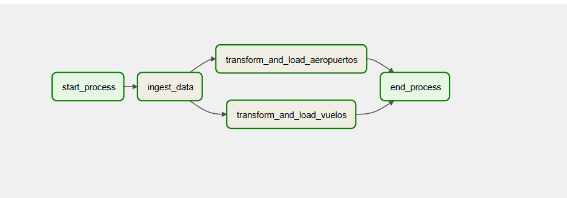

# Ejercicio 1 - Aviación Civil

## Enunciado

La Administración Nacional de Aviación Civil necesita una serie de informes para elevar al
ministerio de transporte acerca de los aterrizajes y despegues en todo el territorio Argentino,
como puede ser: cuales aviones son los que más volaron, cuántos pasajeros volaron, ciudades
de partidas y aterrizajes entre fechas determinadas, etc.

Usted como data engineer deberá realizar un pipeline con esta información, automatizarlo y
realizar los análisis de datos solicitados que permita responder las preguntas de negocio, y
hacer sus recomendaciones con respecto al estado actual.

## Tareas

### 1 - Ingesta de Datos

1. Hacer ingest de los siguientes archivos relacionados con transporte aéreo de Argentina

    - [Informe Ministerio 2021] <https://dataengineerpublic.blob.core.windows.net/data-engineer/2021-informe-ministerio.csv>
    - [Informe Ministerio 2022] <https://dataengineerpublic.blob.core.windows.net/data-engineer/202206-informe-ministerio.csv>
    - [Detalles Aeropuertos] <https://dataengineerpublic.blob.core.windows.net/data-engineer/aeropuertos_detalle.csv>

    Script de Ingesta a HDFS
    El siguiente script descargará los archivos necesarios desde las URLs indicadas y los cargará en HDFS en la ruta `/ingest/aviation_data`:

    `/home/hadoop/scripts/ingest/anac/ingest.sh`

    ```bash
    !/bin/bash

    # Configuración de directorios

    LOCAL_INGEST_DIR="${LOCAL_INGEST_DIR:-/home/hadoop/ingest/aviation_data}"
    HDFS_DEST_DIR="${HDFS_DEST_DIR:-/ingest/aviation_data}"

    # URLs de los datasets

    URL_2021="<https://dataengineerpublic.blob.core.windows.net/data-engineer/2021-informe-ministerio.csv>"
    URL_2022="<https://dataengineerpublic.blob.core.windows.net/data-engineer/202206-informe-ministerio.csv>"
    URL_AEROPUERTOS="<https://dataengineerpublic.blob.core.windows.net/data-engineer/aeropuertos_detalle.csv>"

    # Crear directorio local si no existe

    mkdir -p $LOCAL_INGEST_DIR

    echo "Comenzando la descarga de archivos..."

    # Descargar archivos con validación

    for url in "$URL_2021" "$URL_2022" "$URL_AEROPUERTOS"; do
    filename=$(basename "$url")
    if [ ! -f "$LOCAL_INGEST_DIR/$filename" ]; then
        echo "Descargando $filename..."
        wget -q -P "$LOCAL_INGEST_DIR" "$url" || { echo "Error descargando $filename"; exit 1; }
    else
        echo "$filename ya existe, omitiendo descarga."
    fi
    done

    echo "Archivos descargados exitosamente en $LOCAL_INGEST_DIR"

    # Crear directorio en HDFS si no existe

    echo "Creando directorio en HDFS..."
    hdfs dfs -mkdir -p "$HDFS_DEST_DIR" || { echo "Error creando directorio en HDFS"; exit 1; }

    # Subir archivos a HDFS

    echo "Subiendo archivos a HDFS..."
    hdfs dfs -put -f "$LOCAL_INGEST_DIR"/*.csv "$HDFS_DEST_DIR" || { echo "Error subiendo archivos a HDFS"; exit 1; }

    echo "Archivos cargados exitosamente en HDFS en la ruta: $HDFS_DEST_DIR"

    ```

### 2 - Creación de Tablas en Hive (nuestro data warehouse en este caso)

Los siguientes comandos SQL crean las tablas requeridas en Hive:
(punto 2)

```sql

CREATE DATABASE IF NOT EXISTS aviation_db;

USE aviation_db;

-- tabla para los vuelos realizados en 2021 y 2022
CREATE EXTERNAL TABLE IF NOT EXISTS aeropuerto_tabla (
    fecha DATE COMMENT 'Fecha del vuelo',
    horaUTC STRING COMMENT 'Hora en formato UTC',
    clase_de_vuelo STRING COMMENT 'Clase del vuelo: comercial, privado, etc.',
    clasificacion_de_vuelo STRING COMMENT 'Clasificación del vuelo: nacional, internacional',
    tipo_de_movimiento STRING COMMENT 'Tipo de movimiento: aterrizaje, despegue',
    aeropuerto STRING COMMENT 'Aeropuerto de origen o destino',
    origen_destino STRING COMMENT 'Código del aeropuerto de origen o destino',
    aerolinea_nombre STRING COMMENT 'Nombre de la aerolínea',
    aeronave STRING COMMENT 'Modelo de la aeronave',
    pasajeros INT COMMENT 'Número de pasajeros en el vuelo'
)
STORED AS PARQUET
LOCATION '/aviation_data/flights';

-- tabla para el detalle de los aeropuertos
CREATE EXTERNAL TABLE IF NOT EXISTS aeropuerto_detalles_tabla (
    aeropuerto STRING COMMENT 'Nombre del aeropuerto',
    oac STRING COMMENT 'Código OAC del aeropuerto',
    iata STRING COMMENT 'Código IATA del aeropuerto',
    tipo STRING COMMENT 'Tipo de aeropuerto',
    denominacion STRING COMMENT 'Denominación del aeropuerto',
    coordenadas STRING COMMENT 'Coordenadas del aeropuerto',
    latitud STRING COMMENT 'Latitud del aeropuerto',
    longitud STRING COMMENT 'Longitud del aeropuerto',
    elev FLOAT COMMENT 'Elevación del aeropuerto',
    uom_elev STRING COMMENT 'Unidad de medida de la elevación',
    ref STRING COMMENT 'Referencia del aeropuerto',
    distancia_ref FLOAT COMMENT 'Distancia a la referencia',
    direccion_ref STRING COMMENT 'Dirección a la referencia',
    condicion STRING COMMENT 'Condición del aeropuerto',
    control STRING COMMENT 'Control del aeropuerto',
    region STRING COMMENT 'Región del aeropuerto',
    uso STRING COMMENT 'Uso del aeropuerto',
    trafico STRING COMMENT 'Tipo de tráfico del aeropuerto',
    sna STRING COMMENT 'Código SNA',
    concesionado STRING COMMENT 'Concesión del aeropuerto',
    provincia STRING COMMENT 'Provincia del aeropuerto'
)
STORED AS PARQUET
LOCATION '/aviation_data/airport_details';
```

### 3 - Orquestacion  y Transformación

DAG de Airflow para la ingesta y transformación
Estructura del DAG:

- Tarea de ingesta: `ingest.sh` para descargar y cargar los archivos a HDFS.
- Tareas de transformación: Scripts PySpark `transform_vuelos.py` y `transform_aeropuertos.py` para realizar las transformaciones y cargar los datos en Hive.

DAG de Airflow para la ingesta y transformación de los datos de aviación civil `dag_anac.py`: (punto 3)

```python
from airflow import DAG
from airflow.operators.bash import BashOperator
from airflow.operators.dummy import DummyOperator
from airflow.utils.dates import days_ago

# Argumentos por defecto
default_args = {
    'owner': 'Lucas Leonetti',
    'depends_on_past': False,
    'email_on_failure': False,
    'email_on_retry': False,
    'retries': 1,
}

# Definir el DAG
with DAG(
    'aviation_etl_pipeline',
    default_args=default_args,
    description='ETL Pipeline for ANAC aviation data',
    schedule_interval=None,
    start_date=days_ago(1),
    tags=['aviation', 'spark', 'hive', 'hdfs'],
) as dag:

    # Inicio del proceso
    start_process = DummyOperator(
        task_id='start_process',
    )

    # Ingesta de datos en HDFS
    ingest_data = BashOperator(
        task_id='ingest_data',
        bash_command=" export PATH=/home/hadoop/hadoop/bin:/usr/lib/sqoop/bin:$PATH && \
                /usr/bin/sh /home/hadoop/scripts/ingest/anac/ingest.sh ",
    )

    # Transformación y carga de datos de vuelos con PySpark
    transform_and_load_vuelos = BashOperator(
        task_id='transform_and_load_vuelos',
        bash_command="""
        export PATH=/home/hadoop/spark/bin:/usr/lib/sqoop/bin:$PATH &&
        ssh hadoop@172.17.0.2 '/home/hadoop/spark/bin/spark-submit \
        --files /home/hadoop/hive/conf/hive-site.xml \
        /home/hadoop/scripts/transform/transform_vuelos.py '
         """,
    )

    # Transformación y carga de datos de aeropuertos con PySpark
    transform_and_load_aeropuertos = BashOperator(
        task_id='transform_and_load_aeropuertos',
        bash_command="""
       export PATH=/home/hadoop/spark/bin:/usr/lib/sqoop/bin:$PATH &&
        ssh hadoop@172.17.0.2 '/home/hadoop/spark/bin/spark-submit \
        --files /home/hadoop/hive/conf/hive-site.xml \
        /home/hadoop/scripts/transform/transform_aeropuerto.py '
         """,
    )

    # Final del proceso
    end_process = DummyOperator(
        task_id='end_process',
    )

    # Dependencias del flujo
    start_process >> ingest_data
    ingest_data >> [transform_and_load_vuelos, transform_and_load_aeropuertos]
    [transform_and_load_vuelos, transform_and_load_aeropuertos] >> end_process
```




Script para la transformación de datos de vuelos - PySpark `transform_vuelos.py`:
transformaciones de los datos de vuelos, incluyendo la normalización de nombres de columnas, filtrado de vuelos domésticos, unión de datasets, transformación de tipos, manejo de valores nulos y filtrado por rango de fechas
(punto 4)

```python
from pyspark.sql import SparkSession
from pyspark.sql.functions import col, when, to_date, lit, regexp_replace

# Crear la sesión de Spark con soporte para Hive
spark = SparkSession.builder \
    .appName("TransformacionVuelos") \
    .enableHiveSupport() \
    .getOrCreate()

# Rutas de los archivos en HDFS
vuelos_2021_path = "hdfs://172.17.0.2:9000/ingest/aviation_data/2021-informe-ministerio.csv"
vuelos_2022_path = "hdfs://172.17.0.2:9000/ingest/aviation_data/202206-informe-ministerio.csv"

# Función para normalizar nombres de columnas al formato Hive
def normalize_columns(df):
    return df.toDF(*[c.strip().lower()
                     .replace(" ", "_")
                     .replace("(", "")
                     .replace(")", "")
                     .replace("/", "_")
                     .replace("á", "a")
                     .replace("é", "e")
                     .replace("í", "i")
                     .replace("ó", "o")
                     .replace("ú", "u") for c in df.columns])

# Leer datasets
vuelos_df_2021 = spark.read.option("header", True).option("delimiter", ";").csv(vuelos_2021_path)
vuelos_df_2022 = spark.read.option("header", True).option("delimiter", ";").csv(vuelos_2022_path)

# Normalizar nombres de columnas
vuelos_df_2021 = normalize_columns(vuelos_df_2021)
vuelos_df_2022 = normalize_columns(vuelos_df_2022)

# Filtrar vuelos domésticos
def filter_domesticos(df):
    return df.filter(regexp_replace(col("clasificacion_vuelo"), "é", "e").rlike("(?i)^domestico$"))

vuelos_df_2021 = filter_domesticos(vuelos_df_2021)
vuelos_df_2022 = filter_domesticos(vuelos_df_2022)

# Unir datasets
vuelos_df = vuelos_df_2021.unionByName(vuelos_df_2022)

# Transformar tipos y eliminar columnas innecesarias
vuelos_df = vuelos_df.withColumn("fecha", to_date(col("fecha"), "dd/MM/yyyy")) \
                     .drop("calidad_dato", "pax")

# Manejar valores nulos en 'pasajeros'
vuelos_df = vuelos_df.withColumn("pasajeros", when(col("pasajeros").isNull(), lit(0)).otherwise(col("pasajeros")).cast("int"))

# Renombrar columnas
vuelos_df = vuelos_df.withColumnRenamed("clase_de_vuelo_todos_los_vuelos", "clase_de_vuelo") \
                     .withColumnRenamed("origen___destino", "origen_destino")


# Filtrar rango de fechas
vuelos_df = vuelos_df.filter((col("fecha") >= lit("2021-01-01")) & (col("fecha") <= lit("2022-06-30")))

# Escribir en Hive
hive_db = "aviation_db"
hive_table = "aeropuerto_tabla"

vuelos_df.write.mode("overwrite").insertInto(f"{hive_db}.{hive_table}")

# Finalizar sesión de Spark
spark.stop()
```

Script para la transformación de datos de aeropuertos - PySpark `transform_aeropuertos.py`:
transformaciones de los datos de aeropuertos, incluyendo la normalización de nombres de columnas, eliminación de columnas innecesarias, manejo de valores nulos y cast de tipos (punto 4)

```python
from pyspark.sql import SparkSession
from pyspark.sql.functions import col, when, lit

# Crear la sesión de Spark con soporte para Hive
spark = SparkSession.builder \
    .appName("ProcessAeropuertosData") \
    .enableHiveSupport() \
    .getOrCreate()

# Ruta del archivo en HDFS
aeropuertos_path = "hdfs://172.17.0.2:9000/ingest/aviation_data/aeropuertos_detalle.csv"

# Función para normalizar nombres de columnas
def normalize_columns(df):
    return df.toDF(*[c.strip().lower()
                     .replace(" ", "_")
                     .replace("(", "")
                     .replace(")", "")
                     .replace("/", "_")
                     .replace("á", "a")
                     .replace("é", "e")
                     .replace("í", "i")
                     .replace("ó", "o")
                     .replace("ú", "u") for c in df.columns])

# Leer y normalizar el archivo de detalles de aeropuertos
aeropuertos_df = spark.read.option("header", True).option("delimiter", ";").csv(aeropuertos_path)
aeropuertos_df = normalize_columns(aeropuertos_df)

# Eliminar columnas innecesarias y reemplazar valores nulos en "distancia_ref", castear "elev" a FLOAT 
aeropuertos_df = aeropuertos_df \
    .drop("inhab", "fir") \
    .withColumn("distancia_ref", when(col("distancia_ref").isNull(), lit(0)).otherwise(col("distancia_ref")).cast("float")) \
    .withColumn("elev", when(col("elev").isNull(), lit(0)).otherwise(col("elev")).cast("float"))

aeropuertos_df = aeropuertos_df.withColumnRenamed("local", "aeropuerto")

# Guardar en la tabla Hive
hive_db = "aviation_db"
hive_table_aeropuertos = "aeropuerto_detalles_tabla"
aeropuertos_df.write.mode("overwrite").insertInto(f"{hive_db}.{hive_table_aeropuertos}")

# Finalizar la sesión de Spark
spark.stop()
```

Punto 5 Tipos de campos en las tablas de Hive:

Tabla `aeropuerto_tabla`:


Tabla `aeropuerto_detalles_tabla`:


### Análisis de Datos

Punto 6 Consultas SQL para responder a las preguntas de negocio:

Determinar la cantidad de vuelos entre las fechas 01/12/2021 y 31/01/2022. Mostrar
consulta y Resultado de la query

