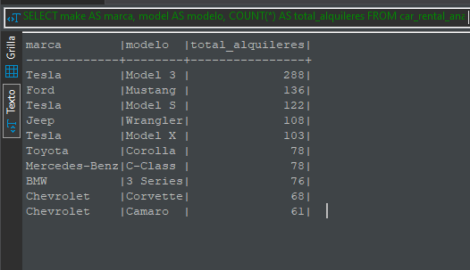

# Ejercicio 2

## Enunciado

Una de las empresas líderes en alquileres de automóviles solicita una serie de dashboards y reportes para poder basar sus decisiones en datos. Entre los indicadores mencionados se
encuentran total de alquileres, segmentación por tipo de combustible, lugar, marca y modelo de automóvil, valoración de cada alquiler, etc.

Como Data Engineer debe crear y automatizar el pipeline para tener como resultado los datos listos para ser visualizados y responder las preguntas de negocio.

## Creacion de la base de datos, Tablas e Ingesta de Datos

>Punto 1

Crear en hive una database car_rental_db y dentro una tabla llamada
car_rental_analytics.

```sql
CREATE DATABASE IF NOT EXISTS car_rental_db;
```

```sql
USE car_rental_db;

CREATE TABLE IF NOT EXISTS car_rental_analytics (
    fuelType STRING,
    rating INT,
    renterTripsTaken INT,
    reviewCount INT,
    city STRING,
    state_name STRING,
    owner_id INT,
    rate_daily INT,
    make STRING,
    model STRING,
    year INT
)
STORED AS PARQUET;
```


>Punto 2

Crear script para el ingest de estos dos files

<https://dataengineerpublic.blob.core.windows.net/data-engineer/CarRentalData.csv>

<https://dataengineerpublic.blob.core.windows.net/data-engineer/georef-united-states-of-america-state.csv>

script `ingest_car_rental.sh` para descargar los archivos y subirlos a HDFS.

```bash
#!/bin/bash

# Definir rutas locales y en HDFS
LOCAL_DIR="/home/hadoop/ingest/car_rental"
HDFS_DIR="/ingest/car_rental"

# Crear directorio local si no existe
mkdir -p $LOCAL_DIR

# Descargar archivos
echo "Descargando archivos..."
wget -P $LOCAL_DIR -O $LOCAL_DIR/CarRentalData.csv https://dataengineerpublic.blob.core.windows.net/data-engineer/CarRentalData.csv
wget -P $LOCAL_DIR -O $LOCAL_DIR/Georef_USA_State.csv "https://dataengineerpublic.blob.core.windows.net/data-engineer/georef-united-states-of-america-state.csv"

# Verificar descargas
if [ $? -ne 0 ]; then
  echo "Error en la descarga de los archivos. Por favor, verifica las URLs."
  exit 1
fi

echo "Archivos descargados exitosamente."

# Crear directorio en HDFS si no existe
echo "Creando directorios en HDFS..."
hdfs dfs -mkdir -p $HDFS_DIR

# Subir archivos a HDFS
echo "Cargando archivos en HDFS..."
hdfs dfs -put -f $LOCAL_DIR/CarRentalData.csv $HDFS_DIR/CarRentalData.csv
hdfs dfs -put -f $LOCAL_DIR/Georef_USA_State.csv $HDFS_DIR/Georef_USA_State.csv

# Verificar carga en HDFS
if [ $? -ne 0 ]; then
  echo "Error en la carga de archivos a HDFS."
  exit 1
fi

echo "Archivos cargados exitosamente en HDFS."
```


## Transformacion de Datos y Carga en Hive

>Punto 3

Crear un script para tomar el archivo desde HDFS y hacer las siguientes
transformaciones:

● En donde sea necesario, modificar los nombres de las columnas. Evitar espacios
y puntos (reemplazar por _ ). Evitar nombres de columna largos

● Redondear los float de ‘rating’ y castear a int.

● Joinear ambos files

● Eliminar los registros con rating nulo

● Cambiar mayúsculas por minúsculas en ‘fuelType’

● Excluir el estado Texas

Finalmente insertar en Hive el resultado

Archivo `transform_car_rental_data.py` para realizar las transformaciones y cargar los datos en Hive mediante pyspark.

```python
from pyspark.sql import SparkSession
from pyspark.sql.functions import col, when, to_date, lit, regexp_replace
from pyspark.sql.functions import min, max
from pyspark.sql.functions import round as pyspark_round 
from pyspark.sql.functions import lower

# Crear la sesión de Spark con soporte para Hive
spark = SparkSession.builder \
    .appName("CarRentalDataTransformation") \
    .enableHiveSupport() \
    .getOrCreate()

# Rutas de los archivos en HDFS
car_rental_path = "hdfs://172.17.0.2:9000/ingest/car_rental/CarRentalData.csv"
georef_path = "hdfs://172.17.0.2:9000/ingest/car_rental/Georef_USA_State.csv"

# Leer los datasets desde HDFS
car_rental_df = spark.read.option("header", True).option("inferSchema", True).csv(car_rental_path)
georef_df = spark.read.option("header", True).option("inferSchema", True).option("delimiter", ";").csv(georef_path)


# Normalizar nombres de columnas para evitar problemas de formato
def normalize_columns(df):
    return df.toDF(*[c.strip().lower()
                     .replace(" ", "_")
                     .replace(".", "_") for c in df.columns])

car_rental_df = normalize_columns(car_rental_df)
georef_df = normalize_columns(georef_df)

# Renombrar y seleccionar columnas relevantes de georef_df
georef_df = georef_df.withColumnRenamed("official_name_state", "state_name") \
                     .withColumnRenamed("united_states_postal_service_state_abbreviation", "state_code") \
                     .select("state_name", "state_code")

# Filtrar el dataset de georef para excluir el estado de Texas
georef_df = georef_df.filter(~col("state_name").rlike("(?i)^texas$"))


# Joinear los datasets por el estado
joined_df = car_rental_df.join(
    georef_df,
    car_rental_df["location_state"] == georef_df["state_code"],
    "inner"
).drop(georef_df["state_code"]) \
 .drop(car_rental_df["location_state"])

# Renombrar columnas para que coincidan con la tabla en Hive
final_df = joined_df.withColumnRenamed("fueltype", "fuel_type") \
                    .withColumnRenamed("rating", "rating") \
                    .withColumnRenamed("rentertripstaken", "renter_trips_taken") \
                    .withColumnRenamed("reviewcount", "review_count") \
                    .withColumnRenamed("location_city", "city") \
                    .withColumnRenamed("location_state", "state_name") \
                    .withColumnRenamed("owner_id", "owner_id") \
                    .withColumnRenamed("rate_daily", "rate_daily") \
                    .withColumnRenamed("vehicle_make", "make") \
                    .withColumnRenamed("vehicle_model", "model") \
                    .withColumnRenamed("vehicle_year", "year")

# Transformar valores
final_df = final_df.withColumn("fuel_type", lower(col("fuel_type"))) \
                   .withColumn("rating", pyspark_round(col("rating"), 0).cast("int"))

# Eliminar registros con rating nulo
final_df = final_df.filter(col("rating").isNotNull())

hive_columns = [
    "fuel_type", "rating", "renter_trips_taken", "review_count",
    "city", "state_name", "owner_id", "rate_daily",
    "make", "model", "year"
]

# Filtrar y ordenar el DataFrame final
final_df_for_hive = final_df.select(*hive_columns)

# Tabla en Hive
hive_table = "car_rental_db.car_rental_analytics"

# Escribir en Hive
final_df_for_hive.write.mode("overwrite").insertInto(hive_table)

# Finalizar la sesión de Spark
spark.stop()
```

## Orquestacion de Pipeline

>Punto 4

Proceso automático en Airflow que orqueste los pipelines creados en los
puntos anteriores. Crear dos tareas:
  
- Un DAG padre que ingente los archivos y luego llame al DAG hijo

- Un DAG hijo que procese la información y la cargue en Hive

Archivo `car_rental_dag.py` para definir el DAG padre en Airflow.

```python
from airflow import DAG
from airflow.operators.bash import BashOperator
from airflow.operators.dummy import DummyOperator
from airflow.operators.trigger_dagrun import TriggerDagRunOperator
from airflow.utils.dates import days_ago

# Configuración del DAG Padre
default_args = {
    'owner': 'Lucas Leonetti',
    'depends_on_past': False,
    'email_on_failure': False,
    'email_on_retry': False,
    'retries': 1,
}

with DAG(
    dag_id='car_rental_parent_dag',
    default_args=default_args,
    description='Parent DAG to ingest data and trigger child DAG',
    schedule_interval=None,
    start_date=days_ago(1),
    tags=['car_rental', 'parent', 'airflow']
) as dag:

    start_task = DummyOperator(
        task_id='start_process'
    )

    ingest_files = BashOperator(
        task_id='ingest_files',
        bash_command="""
        export PATH=/home/hadoop/hadoop/bin:/usr/lib/sqoop/bin:$PATH && \
        /usr/bin/bash /home/hadoop/scripts/ingest/car_rental/ingest_car_rental.sh
        """
    )

    trigger_child_dag = TriggerDagRunOperator(
        task_id='trigger_child_dag',
        trigger_dag_id='car_rental_child_dag'
    )

    end_task = DummyOperator(
        task_id='end_process'
    )

    # Flujo de tareas
    start_task >> ingest_files >> trigger_child_dag >> end_task

```


Archivo `car_rental_child_dag.py` para definir el DAG hijo en Airflow.

```python
from airflow import DAG
from airflow.operators.bash import BashOperator
from airflow.operators.dummy import DummyOperator
from airflow.utils.dates import days_ago

# Configuración del DAG Hijo
default_args = {
    'owner': 'Lucas Leonetti',
    'depends_on_past': False,
    'email_on_failure': False,
    'email_on_retry': False,
    'retries': 1,
}

with DAG(
    dag_id='car_rental_child_dag',
    default_args=default_args,
    description='Child DAG to process and load data into Hive',
    schedule_interval=None,
    start_date=days_ago(1),
    tags=['car_rental', 'child', 'airflow']
) as dag:

    start_task = DummyOperator(
        task_id='start_process'
    )

    process_and_load_data = BashOperator(
        task_id='process_and_load_data',
        bash_command="""
        export PATH=/home/hadoop/spark/bin:/usr/lib/sqoop/bin:$PATH &&
        ssh hadoop@172.17.0.2 /home/hadoop/spark/bin/spark-submit \
        --files /home/hadoop/hive/conf/hive-site.xml \
        /home/hadoop/scripts/transform/transform_car_rental_data.py
        """
    )

    end_task = DummyOperator(
        task_id='end_process'
    )

    # Flujo de tareas
    start_task >> process_and_load_data >> end_task
```


## Analisis de Datos y Visualizacion

>Punto 5

Por medio de consultas SQL al data-warehouse, mostrar:

- Cantidad de alquileres de autos, teniendo en cuenta sólo los vehículos
ecológicos (fuelType hibrido o eléctrico) y con un rating de al menos 4.

```sql
SELECT 
    COUNT(*) AS total_alquileres
FROM 
    car_rental_analytics
WHERE 
    lower(fueltype) IN ('hybrid', 'electric') 
    AND rating >= 4;
```


- los 5 estados con menor cantidad de alquileres

```sql
SELECT 
    state_name, 
    COUNT(*) AS total_alquileres
FROM 
    car_rental_analytics
GROUP BY 
    state_name
ORDER BY 
    total_alquileres ASC
LIMIT 5;
```


- los 10 modelos (junto con su marca) de autos más rentados

```sql
SELECT 
    make AS marca,
    model AS modelo,
    COUNT(*) AS total_alquileres
FROM 
    car_rental_analytics
GROUP BY 
    make, model
ORDER BY 
    total_alquileres DESC
LIMIT 10;
```




- Mostrar por año, cuántos alquileres se hicieron, teniendo en cuenta automóviles
fabricados desde 2010 a 2015

```sql
SELECT 
    year AS anio_fabricacion,
    COUNT(*) AS total_alquileres
FROM 
    car_rental_analytics
WHERE 
    year BETWEEN 2010 AND 2015
GROUP BY 
    year
ORDER BY 
    year ASC;
```


- las 5 ciudades con más alquileres de vehículos ecológicos (fuelType hibrido o
electrico)

```sql
SELECT 
    city AS ciudad,
    fueltype AS tipo_combustible,
    COUNT(*) AS total_alquileres
FROM 
    car_rental_analytics
WHERE 
    LOWER(fueltype) IN ('hybrid', 'electric')
GROUP BY 
    city, fueltype 
ORDER BY 
    total_alquileres DESC
LIMIT 5;
```


- el promedio de reviews, segmentando por tipo de combustible

```sql
SELECT 
    fueltype AS tipo_combustible,
    ROUND(AVG(reviewcount), 2) AS promedio_reviews
FROM 
    car_rental_analytics
GROUP BY 
    fueltype
ORDER BY 
    promedio_reviews DESC;
```


## Conclusiones y Recomendaciones

Se diseñó e implementó un pipeline que transformó datos de car rentals en un formato limpio, integrado y optimizado para su análisis.

Los datos finales se almacenaron en Apache Hive, integrados en un ecosistema Hadoop, permitiendo consultas estructuradas y eficientes.

_Optimización y Limpieza de Datos:_

Se manejaron transformaciones importantes como:
Normalización de nombres de columnas.
Eliminación de registros con valores nulos en campos clave (rating).
Ajustes semánticos como pasar fueltype a minúsculas para facilitar la categorización.
Exclusión de datos innecesarios (estado de Texas), reduciendo ruido en el análisis.

_Preparación para Análisis y Visualización:_

Se logró una integración completa entre datasets relacionados (car_rental y georef), asegurando datos contextualizados con información geográfica.
La tabla en Hive está lista para alimentar dashboards y responder preguntas de negocio, alineándose con los indicadores planteados (total de alquileres, segmentación por combustible, valoración, etc.).

**_Recomendaciones:_**

Incorporación de Datos Externos:

Datos Climatológicos:

Correlacionar alquileres con condiciones climáticas para entender patrones estacionales.

Datos Económicos:

Como tasas de interés o índices de turismo, que podrían influir en la demanda de alquileres.

Datos Demográficos:

Enriquecer con información de clientes, como rangos de edad o tipo de uso (negocios, turismo, etc.).

Arquitectura Híbrida o en la Nube:

On-Premise y Cloud: Si bien el ejercicio utilizó un entorno Hadoop on-premise, considerar migrar o integrar herramientas cloud como Google BigQuery para mayor escalabilidad.
Almacenamiento Intermedio: Usar un data lake para almacenar datos crudos, procesados y enriquecidos de manera independiente, facilitando re-procesamientos.

Visualización y Análisis:

Crear dashboards interactivos que integren herramientas como Tableau, Power BI o Google Data Studio conectados directamente a Hive.
Desarrollar KPIs personalizados basados en preguntas de negocio, como utilización promedio de flota o valoración promedio por segmento.

Documentación y Revisión:

Documentar cada etapa del pipeline (ingesta, transformación, almacenamiento).
Revisar periódicamente las transformaciones para mantener la calidad y relevancia de los datos.

## Arquitectura Cloud sugerida


Componentes de la Arquitectura

**APIs CAR RENTAL**

Fuente principal de datos. Proporciona información en formato JSON o CSV sobre alquileres de automóviles.

**Cloud Functions**

Responsable de la ingesta de datos desde las APIs.
Configurada para activarse por eventos (e.g., llamadas programadas o cambios en la fuente). Transforma y almacena los datos crudos en Cloud Storage.

**Cloud Storage**

Actúa como un repositorio centralizado para almacenar los datos en formato bruto.
Proporciona alta disponibilidad y capacidad de escalabilidad para manejar grandes volúmenes de datos.

**Dataflow**

Herramienta para la transformación y procesamiento de datos en tiempo real o batch.

Realiza:

Limpieza y transformación de datos (e.g., normalización, eliminación de nulos, formateo).
Unión con otras fuentes de datos si es necesario.
Escribe los datos transformados en BigQuery para su análisis.

**BigQuery**

Almacén de datos analíticos para consultas rápidas y escalables.
Permite realizar análisis multidimensionales y crear vistas para reportes específicos.
Compatible con herramientas de visualización como Looker.

**Looker**

Plataforma de visualización de datos conectada directamente a BigQuery.
Permite la creación de dashboards interactivos y reportes personalizados para responder a preguntas de negocio.

**Cloud Composer**

Orquesta todo el pipeline utilizando DAGs (Directed Acyclic Graphs).
Coordina las dependencias entre tareas y asegura la ejecución fluida del proceso.
