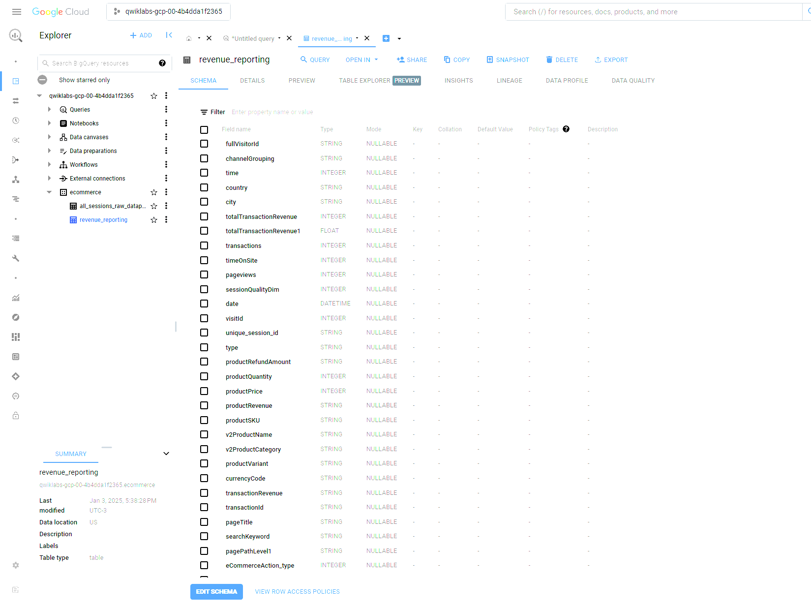

# Google Skill Boost - Examen Final

Capturas de pantalla de la ejecución del proceso y la tabla final limpia y transformada en BigQuery  utilizando Dataprep

## Preguntas

Contestar las siguientes preguntas:

**1. ¿Para que se utiliza data prep?**

    Google Cloud Dataprep es un servicio serverless (sin necesidad de administrar servidores) que permite:

    - Explorar y perfilizar (hacer “profiling”) grandes volúmenes de datos.
    - Limpiar, transformar y enriquecer datos de manera intuitiva, a través de una interfaz gráfica interactiva.
    - Generar y automatizar flujos de trabajo (pipelines) para llevar datos limpios y listos a sistemas de análisis (por ejemplo, BigQuery) o de Machine Learning.

    Su principal objetivo es simplificar la llamada etapa de “data wrangling” —es decir, el proceso de convertir datos crudos en datos de calidad y con el formato adecuado para análisis, dashboards o modelos predictivos— de forma colaborativa y sin requerir un alto conocimiento de lenguajes de programación.

**2. ¿Qué cosas se pueden realizar con DataPrep?**

    - Exploración de datos:
    Vista previa de los datos, perfiles estadísticos, distribución de valores y detección de anomalías.
    - Transformaciones:
    Limpieza y formateo de datos (eliminación de duplicados, cambio de mayúsculas/minúsculas, normalización, etc.).
    Conversión de tipos de datos (por ejemplo, de texto a fecha/hora).
    División o combinación de columnas.
    Manejo de valores faltantes o nulos.
    - Filtrado y enriquecimiento:
    Filtros avanzados basados en expresiones lógicas o patrones de texto.
    Creación de columnas derivadas (cálculos, agregaciones, transformaciones matemáticas o de texto).
    - Validación:
    Detección de inconsistencias o errores con reglas de calidad de datos.
    Sugerencias automáticas de limpieza basadas en patrones comunes.
    - Generación de “recipes” y documentación:
    Cada conjunto de transformaciones se guarda en una especie de “receta” repetible.
    Versionado y tracking de cambios para un mayor control y auditoría.
    - Orquestación y scheduling:
    Programar o automatizar la ejecución de las transformaciones.
    Integrarse con otros servicios de GCP para flujos de trabajo de datos (ej. Dataflow, Cloud Composer, etc.).

**3. ¿Por qué otra/s herramientas lo podrías reemplazar? Por qué?**

    - Cloud Data Fusion (también en GCP):

    Ofrece una interfaz visual para crear pipelines de ETL/ELT con más opciones de conectores.
    Incluye herramientas de Data Wrangling (basadas en lo que antes era Data Wrangler).
    Más orientado a escenarios de integración de datos a gran escala.
    
    - Apache Spark o Databricks:

    Apropiado cuando se requiere un procesamiento distribuido y más flexible a gran escala.
    Involucra más código (PySpark, Scala), pero es extremadamente potente para big data.
    
    - Dataflow (Apache Beam):

    Ideal para pipelines de procesamiento de datos en streaming y batch.
    Requiere más experiencia en programación para construir pipelines, aunque brinda gran escalabilidad.

    - Herramientas de BI o ETL tradicionales:

    Ejemplos: Talend, Informatica, Pentaho, etc.

    - Procesos manuales en SQL, Python (Pandas), R:

    Es posible replicar lógicas de limpieza y transformación usando scripts manuales, pero puede ser menos colaborativo y con mayor riesgo de errores.

    - ¿Por qué se podría reemplazar?

    - Caso de uso: Si el equipo ya está familiarizado con SQL, Python o Spark, y no necesita la interfaz visual ni las sugerencias de Dataprep, podría decidir usar esas herramientas.
    - Costos: Algunas organizaciones ya tienen licencias de ETL/ELT y no quieren pagar servicios adicionales.
    - Ecosistema: Preferencia por soluciones on-premises o híbridas, o compatibilidad con otras nubes.

**4. ¿Cuáles son los casos de uso comunes de Data Prep de GCP?**

    - Limpieza de datos para análisis: Antes de cargar la data en BigQuery para dashboards o análisis exploratorios.
    - Transformación previa a Machine Learning: Estandarizar datos para alimentar modelos en Vertex AI o notebooks de ML.
    - Data Wrangling colaborativo: Varias personas (analistas, científicos de datos, ingenieros) trabajando sobre el mismo dataset.
    - Migración de datos: Convertir formatos (CSV, JSON, Excel) a un esquema común y luego almacenarlos en un Data Warehouse.
    - Preparación rápida para prototipos: Cuando se requiere una limpieza y exploración ágil sin invertir en un pipeline complejo.

**5. ¿Cómo se cargan los datos en Data Prep de GCP?**

    Dataprep se integra estrechamente con servicios de GCP, por lo que las fuentes más comunes son:

    - Google Cloud Storage (GCS): Se puede seleccionar archivos CSV, JSON, Avro, Parquet, Excel, etc. que residen en un bucket.
    - BigQuery: Cargar tablas existentes para transformarlas y luego volver a guardar la versión limpia en otra tabla.
    - Archivos locales: Subir datos manualmente desde tu computadora (aunque la práctica recomendada suele ser guardarlos primero en GCS).
    - Fuentes externas: Algunas conexiones a bases de datos relacionales o a SaaS (dependiendo del plan de Trifacta/Dataprep) también son posibles.

**6. ¿Qué tipos de datos se pueden preparar en Data Prep de GCP?**

    Dataprep soporta, principalmente, datos tabulares o semiestructurados. Entre los formatos más comunes:

    - CSV, TSV, TXT con distintos delimitadores.
    - JSON (incluyendo jerárquico, aunque Dataprep “aplana” la estructura para facilitar la transformación).
    - Parquet y Avro (formatos optimizados para big data).
    - Hojas de cálculo (Excel, Google Sheets, etc.).
    - Logs semiestructurados (donde se detecta un patrón de columnas).

**7. ¿Qué pasos se pueden seguir para limpiar y transformar datos en Data Prep de GCP?**

    Un flujo típico de limpieza y transformación en Dataprep podría ser:

    - Crear un dataset o importar datos: Apuntar a la fuente en GCS o BigQuery.
    - Exploración y perfilado inicial: Dataprep genera estadísticas rápidas (valores faltantes, distribuciones, tipos de datos).
    - Creación de una receta (“recipe”):
    Agregar pasos de transformación con las herramientas visuales o usando el lenguaje de expresiones de Trifacta.
    Cada paso es inmutable y se registra en la receta.
    - Sugerencias inteligentes: Dataprep sugiere reglas de limpieza, por ejemplo, si detecta valores inconsistentes en una columna de fechas.
    - Validación continua: Observa en tiempo real cómo cada transformación afecta los datos. Ajustar si algo no luce correcto.
    - Generar la salida: Una vez validado, se puede generar una versión final (output) en un nuevo archivo en GCS o en una tabla de BigQuery.
    - Iteración: Ajustar, revisar, volver a ejecutar la receta hasta que los datos cumplan con los requisitos de calidad.

**8. ¿Cómo se pueden automatizar tareas de preparación de datos en Data Prep de GCP?**

    - Creación de flujos (flows):
        - Se pueden encadenar varias recetas y datasets en un mismo flujo de trabajo.
    - Programación (scheduling):
        - Dataprep permite programar la ejecución de los flujos de manera recurrente (por ejemplo, diariamente o cada hora).
        - Integración con herramientas de orquestación como Cloud Composer (basado en Apache Airflow) para coordinar flujos más complejos.
    - APIs y Webhooks:
        - Dependiendo de la licencia, existen opciones de invocar Dataprep mediante APIs para desencadenar ejecuciones en respuesta a eventos externos.
    - Integración con CI/CD:
        - Es posible incluir Dataprep en pipelines de integración continua para garantizar que cada actualización de datos cumpla con procesos de limpieza.

**9. ¿Qué tipos de visualizaciones se pueden crear en Data Prep de GCP?**

    Dentro de la interfaz de Dataprep, se generan visualizaciones sencillas y estadísticas descriptivas para ayudarte a tomar decisiones de transformación:

    - Histogramas de distribución de valores en una columna.
    - Gráficas de barras para frecuencias o conteos.
    - Gráficas de cajas y bigotes (box plots) para detectar outliers (en algunos escenarios).
    - Distribución de valores nulos, duplicados o inconsistencia de tipos.

    Estas visualizaciones son interactivas y se actualizan con cada paso de la receta, facilitando la detección de problemas. Sin embargo, no es una herramienta de BI completa: para dashboards complejos, se suelen exportar los datos limpios a BigQuery y luego utilizar Looker, Data Studio (Looker Studio) u otra solución analítica.

**10. ¿Cómo se puede garantizar la calidad de los datos en Data Prep de GCP?**

    - Profiling continuo:
        - Desde la primera carga, Dataprep muestra conteo de valores válidos, faltantes o poco frecuentes.
    - Reglas de validación:
        - Puedes establecer reglas (por ejemplo, “la columna A debe ser un número entero entre X e Y”) y Dataprep marcará los registros que no cumplan.
    - Manejo de excepciones:
        - Aplicar transformaciones condicionales (if-else) para corregir, eliminar o marcar datos erróneos.
    - Auditoría y versionado de recetas:
        - Cada paso en la receta queda registrado. Esto permite revisitar cambios, hacer rollbacks, y comprobar quién hizo qué y cuándo.
    - Pruebas de datos (Data Tests):
        - Antes de “promover” la receta a producción, se puede correr un subconjunto de datos (muestra) para verificar la calidad de forma iterativa.
    - Integración con pipelines de orquestación:
        - Si se realiza la validación en cada paso antes de mover datos a la siguiente etapa, se evitan contaminaciones de datos erróneos.

## Arquitecura

El gerente de Analitca te pide realizar una arquitectura hecha en GCP que contemple el uso de esta herramienta ya que le parece muy fácil de usar y una interfaz visual que ayuda a sus desarrolladores ya que no necesitan conocer ningún lenguaje de desarrollo.

Esta arquitectura debería contemplar las siguientes etapas:

>Ingesta:
Datos parquet almacenados en un bucket de S3 y datos de una aplicación que guarda
sus datos en Cloud SQL.

>Procesamiento:
filtrar, limpiar y procesar datos provenientes de estas fuentes

>Almacenar:
almacenar los datos procesados en BigQuery

>BI:
herramientas para visualizar la información almacenada en el Data Warehouse

>ML:
Herramienta para construir un modelo de regresión lineal con la información almacenada
en el Data Warehouse

### Descripciones de los componentes

1. AWS S3 -> GCS con Storage Transfer Service.
2. Cloud SQL (exportación a GCS).
3. Dataprep para la etapa de data wrangling (visual, sin código).
4. BigQuery como destino de los datos limpios (Data Warehouse).
5. BI con Looker Studio, Looker, etc.
6. ML con Vertex AI.
