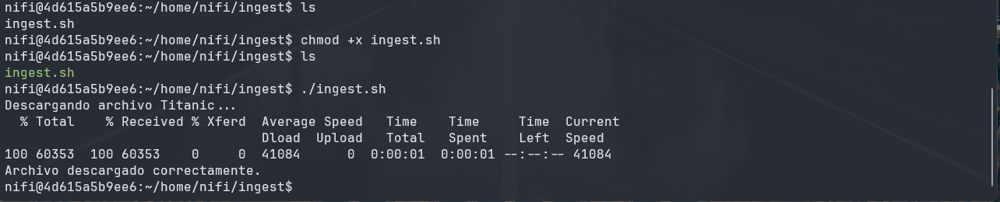
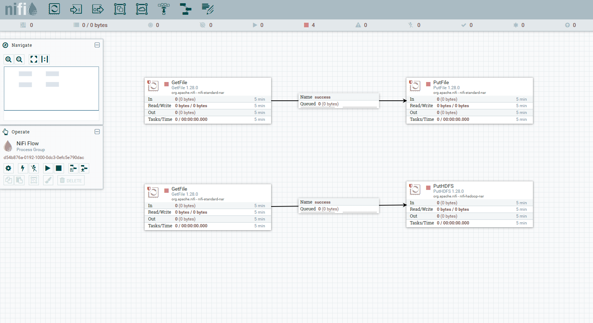
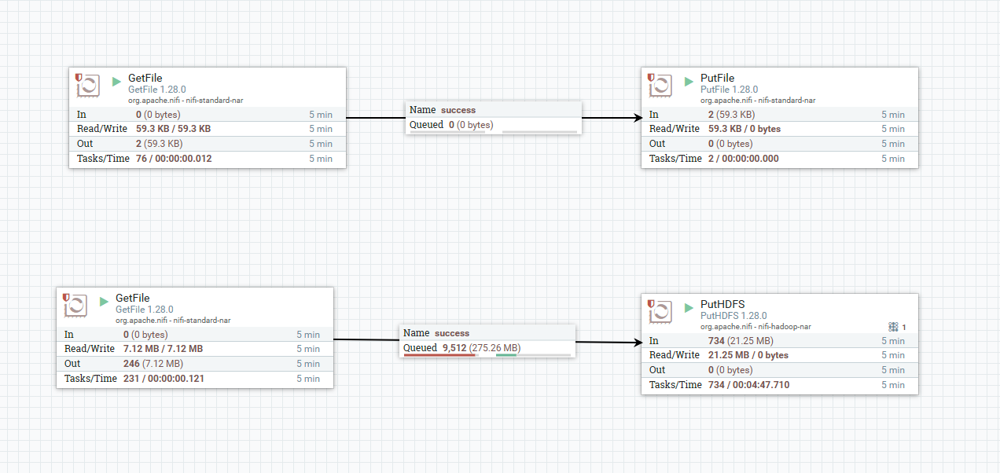
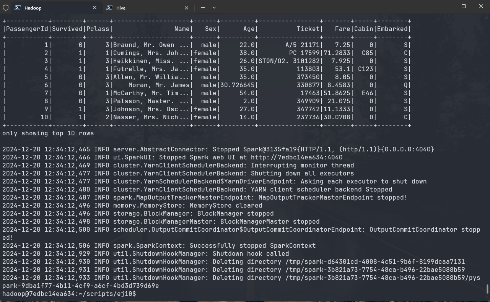
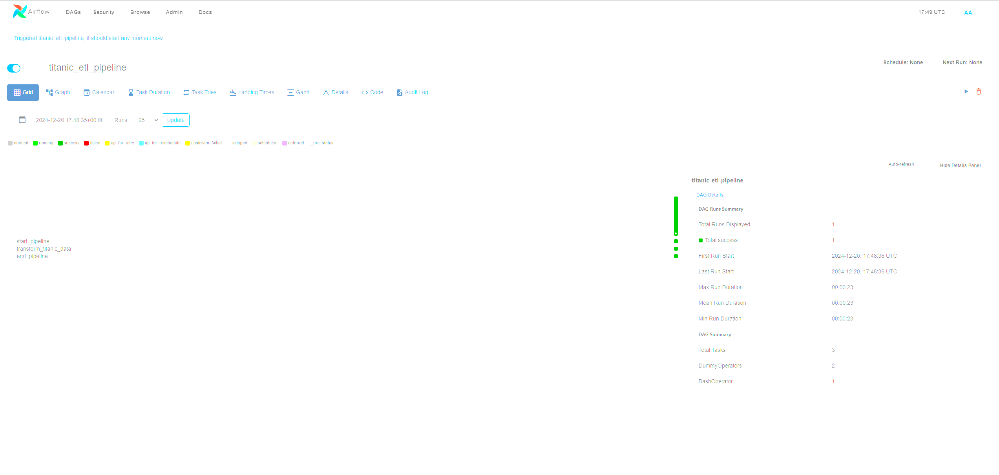
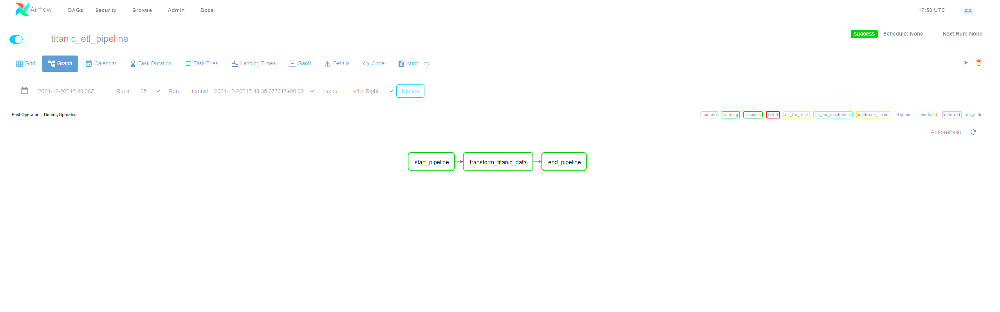
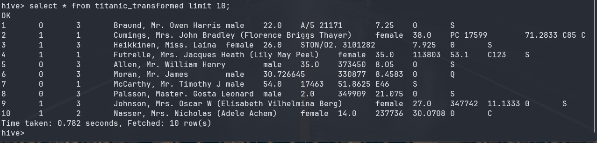

# Ejercicio Clase 10

## NiFi - Hadoop - Airflow

## Objetivo

El objetivo de este ejercicio es realizar la ingestión de datos de un archivo CSV a HDFS utilizando Apache NiFi. Realizando ciertas transformaciones en los datos antes de ser almacenados en Hive. Para ello, se utilizará Apache Airflow para orquestar el proceso de transformación y carga de datos.

> <https://localhost:8443/nifi>

1. En el shell de Nifi, crear un script .sh que descargue el archivo titanic.csv al directorio /home/nifi/ingest (crearlo si es necesario). Ejecutarlo con ./home/nifi/ingest/ingest.sh

    ```bash
    #!/bin/bash

    # Script para descargar el archivo titanic.csv

    if [ ! -f "/home/nifi/ingest/titanic.csv" ]; then
        echo "Descargando archivo Titanic..."
        curl -o /home/nifi/ingest/titanic.csv \
        <https://dataengineerpublic.blob.core.windows.net/data-engineer/titanic.csv>
        echo "Archivo descargado correctamente."
    else
        echo "El archivo titanic.csv ya existe."
    fi
    ```

    

2. Usando procesos Nifi:
    - tomar el archivo `titanic.csv` desde el directorio `/home/nifi/ingest`.
    - Mover el archivo `titanic.csv` desde el directorio anterior, a `/home/nifi/bucket`(crear el directorio si es necesario)
    - Tomar nuevamente el archivo, ahora desde `/home/nifi/bucket`
    - Ingestarlo en HDFS/nifi (si es necesario, crear el directorio con `hdfs dfs -mkdir/nifi`)

    Resumen del Flujo en NiFi

    - GetFile → Lee el archivo desde /home/nifi/ingest.
    - PutFile → Mueve el archivo a /home/nifi/bucket.
    - GetFile → Vuelve a tomar el archivo desde /home/nifi/bucket.
    - PutHDFS → Ingresa el archivo en HDFS dentro del directorio /nifi.

    

    Notese el tamaño de algunas acciones de lectura y escritura, esto se debe a la estrategia de nifi de lectura y escritura.
    

3. Una vez que tengamos el archivo titanic.csv en HDFS realizar un pipeline en Airflow que
ingeste este archivo y lo cargue en HIVE, teniendo en cuenta las siguientes
transformaciones:
    - Remover las columnas SibSp y Parch
    - Por cada fila calcular el promedio de edad de los hombres en caso que sea
    hombre y promedio de edad de las mujeres en caso que sea mujer
    - Si el valor de cabina en nulo, dejarlo en 0 (cero)

    ejercicio_10.py (DAG Airflow)

    ```python
    from airflow import DAG
    from airflow.operators.bash import BashOperator
    from airflow.utils.dates import days_ago
    from airflow.utils.task_group import TaskGroup
    from airflow.operators.dummy import DummyOperator

    # Argumentos por defecto

    default_args = {
        'owner': 'Lucas Leonetti',
        'depends_on_past': False,
        'email_on_failure': False,
        'email_on_retry': False,
        'retries': 1,
    }

    # Definir el DAG

    with DAG(
        'titanic_etl_pipeline',
        default_args=default_args,
        description='Pipeline para transformar y cargar datos de Titanic en Hive',
        schedule_interval=None,
        start_date=days_ago(1),
        tags=['titanic', 'pyspark', 'hive'],
    ) as dag:

        # Inicio del pipeline
        start_pipeline = DummyOperator(
            task_id='start_pipeline',
            dag=dag
        )

        # Transformar datos con PySpark
        transform_titanic_data = BashOperator(
            task_id='transform_titanic_data',
            bash_command="""
            export PATH=/home/hadoop/spark/bin:$PATH &&
            ssh hadoop@172.17.0.2 '/home/hadoop/spark/bin/spark-submit \
            --files /home/hadoop/hive/conf/hive-site.xml \
            /home/hadoop/scripts/ej10/transform_titanic_data.py '
            """
        )

        # Final del pipeline
        end_pipeline = DummyOperator(
            task_id='end_pipeline',
            dag=dag
        )

        # Definir flujo del pipeline
        start_pipeline >> transform_titanic_data >> end_pipeline
    ```

    transform_titanic_data.py (Script PySpark)

    ```python
    from pyspark.sql import SparkSession
    from pyspark.sql.functions import col, when, avg

    # Crear sesión de Spark con soporte para Hive

    spark = SparkSession.builder \
        .appName("TransformTitanicData") \
        .enableHiveSupport() \
        .getOrCreate()

    # Ruta del archivo Titanic en HDFS
    titanic_path = "hdfs://172.17.0.2:9000/nifi/titanic.csv"

    # Nombre de la base de datos y tabla de destino en Hive
    hive_db = "titanic_analytics"
    hive_table = "titanic_transformed"

    # Leer los datos desde HDFS en formato CSV
    titanic_df = spark.read.csv(titanic_path, header=True, inferSchema=True)

    # Remover columnas SibSp y Parch
    titanic_cleaned_df = titanic_df.drop("SibSp", "Parch")

    # Calcular promedio de edad para hombres y mujeres
    avg_age_male = titanic_cleaned_df.filter(col("Sex") == "male").agg(avg("Age")).first()[0]
    avg_age_female = titanic_cleaned_df.filter(col("Sex") == "female").agg(avg("Age")).first()[0]

    # Reemplazar valores nulos en "Age" con promedio según género

    titanic_transformed_df = titanic_cleaned_df.withColumn(
        "Age",
        when(col("Sex") == "male", when(col("Age").isNull(), avg_age_male).otherwise(col("Age")))
        .when(col("Sex") == "female", when(col("Age").isNull(), avg_age_female).otherwise(col("Age")))
    )

    # Reemplazar valores nulos en "Cabin" con 0

    titanic_transformed_df = titanic_transformed_df.withColumn(
        "Cabin",
        when(col("Cabin").isNull(), "0").otherwise(col("Cabin"))
    )

    # Asegurarse de que los tipos de datos coincidan con la tabla Hive
    titanic_transformed_df = titanic_transformed_df.select(
        col("PassengerId").cast("int"),
        col("Survived").cast("int"),
        col("Pclass").cast("int"),
        col("Name").cast("string"),
        col("Sex").cast("string"),
        col("Age").cast("float"),
        col("Ticket").cast("string"),
        col("Fare").cast("float"),
        col("Cabin").cast("string"),
        col("Embarked").cast("string")
    )
    
    # Insertar datos transformados en Hive
    titanic_transformed_df.write.mode("overwrite").insertInto(f"{hive_db}.{hive_table}")

    # Mostrar datos transformados (opcional)
    titanic_transformed_df.show(10)

    # Finalizar sesión de Spark
    spark.stop()
    ```

    

    

    

    

## Conclusiones

En este ejercicio se realizó la ingestión de un archivo CSV a HDFS utilizando Apache NiFi, realizando ciertas transformaciones en los datos antes de ser almacenados en Hive. Para ello, se utilizó Apache Airflow para orquestar el proceso de transformación y carga de datos. Se creó un script en NiFi para descargar el archivo `titanic.csv` y se creó un flujo en NiFi para tomar el archivo, moverlo a otro directorio y luego ingresarlo en HDFS. Luego, se creó un pipeline en Airflow que ingesta el archivo `titanic.csv` y lo carga en Hive, realizando las transformaciones solicitadas. Se creó un script en PySpark para realizar las transformaciones y cargar los datos en Hive. Finalmente, se ejecutó el pipeline en Airflow y se verificó que los datos se cargaron correctamente en Hive.
