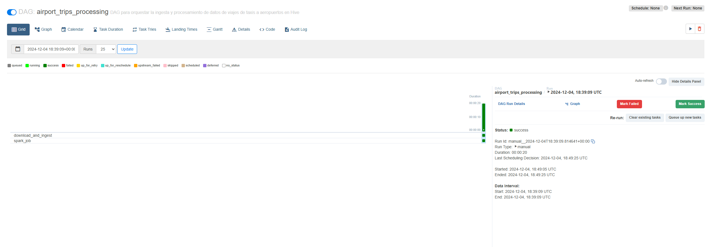

# Clase 7 - Ejercitacion Airflow y Spark. Taxis en NYC

## Ejercicios

Diccionario de datos:
    <https://www.nyc.gov/assets/tlc/downloads/pdf/data_dictionary_trip_records_yellow.pdf>

1. En Hive, crear la siguiente tabla (externa) en la base de datos tripdata:

    - airport_trips(tpep_pickup_datetetime, airport_fee, payment_type, tolls_amount, total_amount)
2. En Hive, mostrar el esquema de airport_trips

    

3. Crear un archivo .bash que permita descargar los archivos mencionados abajo e
ingestarlos en HDFS:

    ```bash
    #!/bin/bash

    # Crear el directorio en HDFS si no existe
    hdfs dfs -mkdir -p /ingest

    # Descargar los archivos usando wget
    echo "Descargando yellow_tripdata_2021-01.parquet..."
    wget -O yellow_tripdata_2021-01.parquet "https://dataengineerpublic.blob.core.windows.net/data-engineer/yellow_tripdata_2021-01.parquet"

    echo "Descargando yellow_tripdata_2021-02.parquet..."
    wget -O yellow_tripdata_2021-02.parquet "https://dataengineerpublic.blob.core.windows.net/data-engineer/yellow_tripdata_2021-02.parquet"

    # Ingestar los archivos en HDFS
    echo "Ingestando yellow_tripdata_2021-01.parquet en HDFS..."
    hdfs dfs -put -f yellow_tripdata_2021-01.parquet /ingest/

    echo "Ingestando yellow_tripdata_2021-02.parquet en HDFS..."
    hdfs dfs -put -f yellow_tripdata_2021-02.parquet /ingest/

    # Mensaje de éxito
    echo "Descarga e ingesta completadas con éxito."
    ```

    

4. Crear un archivo .py que permita, mediante Spark (pyspark), crear un data frame uniendo los
viajes del mes 01 y mes 02 del año 2021 y luego Insertar en la tabla airport_trips los
viajes que tuvieron como inicio o destino aeropuertos, que hayan pagado con dinero en efectivo.

    ```python

    from pyspark.sql import SparkSession

    from pyspark.sql.functions import col, when, lit

    # Crear la sesión de Spark

    spark = SparkSession.builder \
    .appName("Airport Trips Processing") \
    .enableHiveSupport() \
    .getOrCreate()

    # Paso 1: Leer los archivos desde HDFS

    print("Leyendo los archivos de viajes desde HDFS...")
    df_january = spark.read.parquet("hdfs://172.17.0.2:9000/ingest/yellow_tripdata_2021-01.parquet")
    df_february = spark.read.parquet("hdfs://172.17.0.2:9000/ingest/yellow_tripdata_2021-02.parquet")

    # Paso 2: Unir los dataframes de enero y febrero

    print("Uniendo los datos de enero y febrero de 2021...")
    combined_df = df_january.union(df_february)

    # Paso 3: Filtrar los registros que tienen como destino u origen un aeropuerto y pagaron en efectivo

    # Utilizamos el campo RateCodeID para identificar los aeropuertos (2 = JFK, 3 = Newark)

    filtered_df = combined_df.filter(
        (col("RatecodeID").isin([2, 3])) &  # JFK o Newark
        (col("payment_type") == 2)          # Pagado en efectivo
    )

    # Paso 4: Asignar el valor a la columna `airport_fee` basado en `PULocationID`

    # Nota: Asumimos que JFK y LaGuardia tienen códigos específicos en `PULocationID`

    airport_trips_df = filtered_df.withColumn(
        "airport_fee",
        when(col("PULocationID").isin([132, 138]), lit(1.25)).otherwise(lit(0.0))  # 132 y 138 son los códigos de JFK y LaGuardia
    )

    # columnas necesarias para la tabla airport_trips

    airport_trips_df = airport_trips_df.select(
        col("tpep_pickup_datetime").cast("string"),
        col("airport_fee").cast("double"),
        col("payment_type").cast("int"),
        col("tolls_amount").cast("double"),
        col("total_amount").cast("double")
    )

    # Insertar los registros en la tabla airport_trips en Hive

    print("Insertando los registros en la tabla airport_trips de Hive...")
    airport_trips_df.write.mode("append").insertInto("tripdata.airport_trips")

    print("Ingesta completada con exito.")

    ```

    

5. Realizar un proceso automático en Airflow que orqueste los archivos creados en los
puntos 3 y 4. Correrlo y mostrar una captura de pantalla (del DAG y del resultado en la
base de datos)

    ```python
    from airflow import DAG
    from airflow.operators.bash import BashOperator
    from airflow.providers.apache.spark.operators.spark_submit import SparkSubmitOperator
    from datetime import datetime, timedelta

    # argumentos básicos para el DAG

    default_args = {
        'owner': 'Lucas Leonetti',
        'depends_on_past': False,
        'retries': 1,
        'retry_delay': timedelta(minutes=2),
    }

    # DAG

    with DAG(
        'airport_trips_processing',
        default_args=default_args,
        description='DAG para orquestar la ingesta y procesamiento de datos de viajes de taxis a aeropuertos en Hive',
        schedule_interval=None,
        start_date=datetime(2024, 12, 3),
        catchup=False,
    ) as dag:

        # Task 1: Descargar e Ingestar los Archivos en HDFS
        download_and_ingest = BashOperator(
            task_id='download_and_ingest',
            bash_command='/usr/bin/sh /home/hadoop/scripts/landing.sh ',
        )

        # Task 2: PySpark para Procesar los Datos usando BashOperator
        spark_job = BashOperator(
            task_id='spark_job',
            bash_command='ssh hadoop@172.17.0.2 /home/hadoop/spark/bin/spark-submit --files /home/hadoop/hive/conf/hive-site.xml /home/hadoop/scripts/airport_trips_ingestion.py ',
        )


        # Definir las dependencias
        download_and_ingest >> spark_job
    ```

    

    

    

    

## Conclusiones

En este ejercicio, hemos creado un pipeline de datos que descarga archivos de viajes de taxis en NYC, los ingesta en HDFS, los procesa con Spark y finalmente inserta los datos procesados en una tabla de Hive. Este pipeline fue orquestado con Apache Airflow, lo que nos permitió automatizar todo el proceso y ejecutarlo de manera programada.
