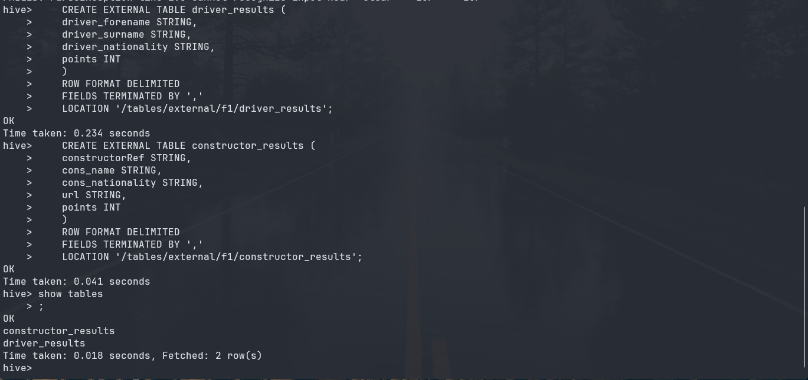
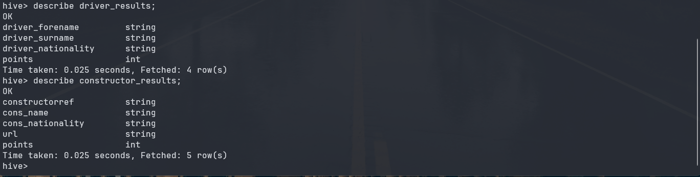
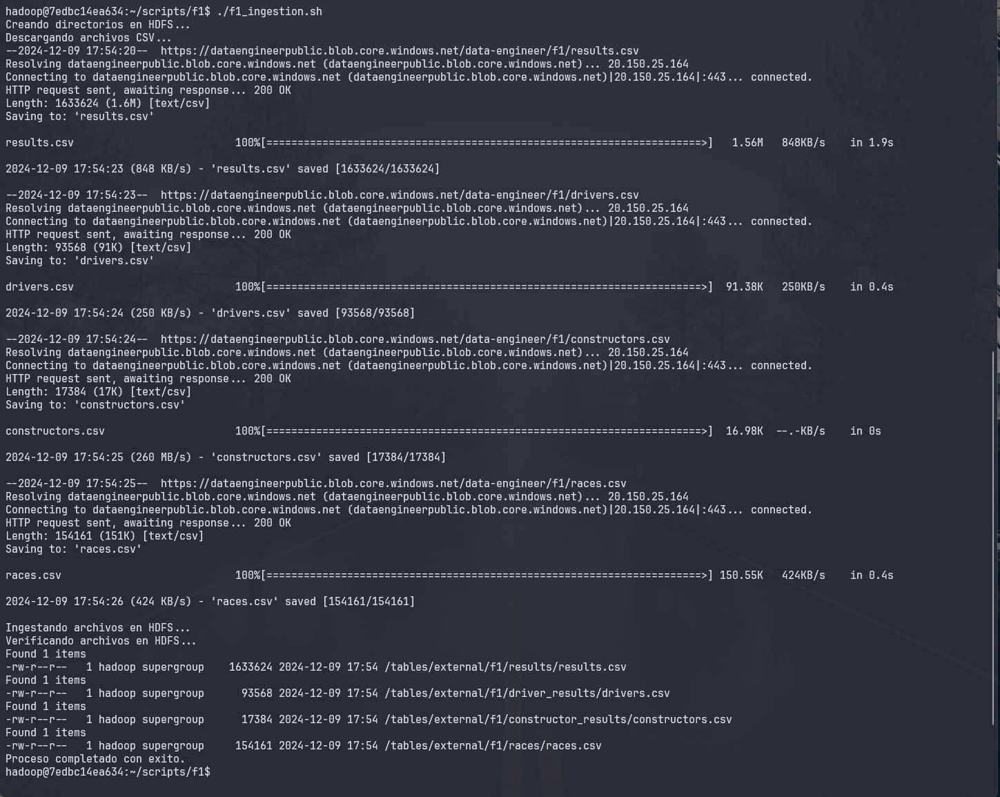
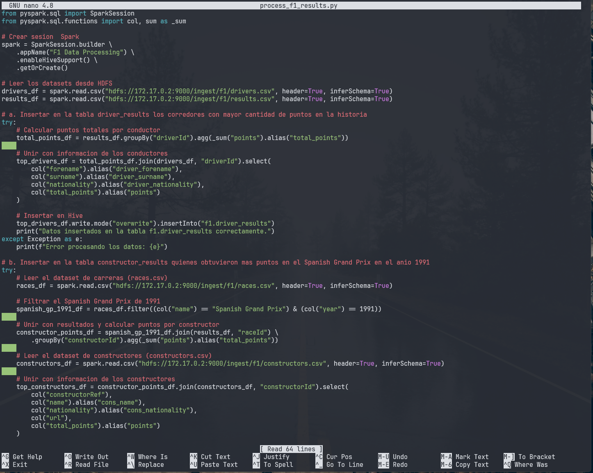
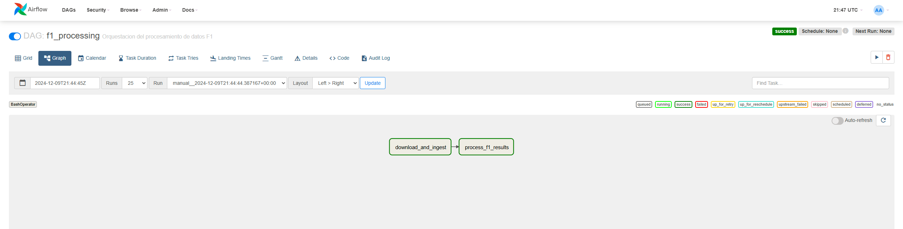
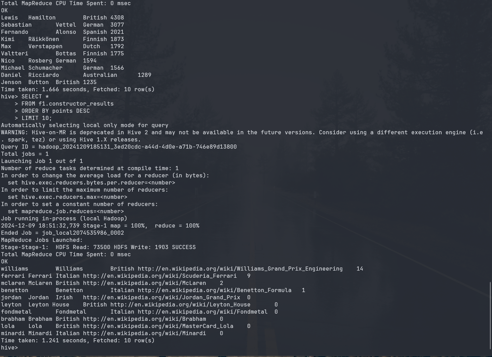

# Ejercicios Clase 8 - Orquestación, Airflow, Spark y Hive. Fórmula 1 Dataset

## Diccionario de datos

<https://www.kaggle.com/datasets/rohanrao/formula-1-world-championship-1950-2020?select=results.csv>

1. Crear la siguientes tablas externas en la base de datos f1 en hive:

    a. driver_results (driver_forename, driver_surname, driver_nationality, points)
    b. constructor_results (constructorRef, cons_name, cons_nationality, url, points)

    ```sql
    CREATE DATABASE IF NOT EXISTS f1;
    USE f1;
    ```

    ```sql
    CREATE EXTERNAL TABLE driver_results (
    driver_forename STRING,
    driver_surname STRING,
    driver_nationality STRING,
    points INT
    )
    ROW FORMAT DELIMITED
    FIELDS TERMINATED BY ','
    LOCATION '/tables/external/f1/driver_results'
    ```

    ```sql
    CREATE EXTERNAL TABLE constructor_results (
    constructorRef STRING,
    cons_name STRING,
    cons_nationality STRING,
    url STRING,
    points INT
    )
    ROW FORMAT DELIMITED
    FIELDS TERMINATED BY ','
    LOCATION '/tables/external/f1/constructor_results'
    ```

    

2. En Hive, mostrar el esquema de driver_results y constructor_results

    

3. Crear un archivo .bash que permita descargar los archivos mencionados abajo e
ingestarlos en HDFS:
    results.csv
    <https://dataengineerpublic.blob.core.windows.net/data-engineer/f1/results.csv>
    drivers.csv
    <https://dataengineerpublic.blob.core.windows.net/data-engineer/f1/drivers.csv>
    constructors.csv
    <https://dataengineerpublic.blob.core.windows.net/data-engineer/f1/constructors.csv>
    races.csv
    <https://dataengineerpublic.blob.core.windows.net/data-engineer/f1/races.csv>

    ```bash
    # !/bin/bash

    # Definir rutas en HDFS

    HDFS_PATH="/tables/external/f1"

    # Crear directorios en HDFS si no existen

    echo "Creando directorios en HDFS..."
    hdfs dfs -mkdir -p $HDFS_PATH/driver_results
    hdfs dfs -mkdir -p $HDFS_PATH/constructor_results
    hdfs dfs -mkdir -p $HDFS_PATH/results
    hdfs dfs -mkdir -p $HDFS_PATH/races

    # Descarga de archivos

    echo "Descargando archivos CSV..."
    wget -O results.csv <https://dataengineerpublic.blob.core.windows.net/data-engineer/f1/results.csv>
    wget -O drivers.csv <https://dataengineerpublic.blob.core.windows.net/data-engineer/f1/drivers.csv>
    wget -O constructors.csv <https://dataengineerpublic.blob.core.windows.net/data-engineer/f1/constructors.csv>
    wget -O races.csv <https://dataengineerpublic.blob.core.windows.net/data-engineer/f1/races.csv>

    # Verificar si los archivos se descargaron correctamente

    if [ ! -f "results.csv" ] || [ ! -f "drivers.csv" ] || [ ! -f "constructors.csv" ] || [ ! -f "races.csv" ]; then
    echo "Error: Uno o más archivos no se descargaron correctamente."
    exit 1
    fi

    # Ingesta de los archivos en HDFS

    echo "Ingestando archivos en HDFS..."
    hdfs dfs -put -f results.csv $HDFS_PATH/results/
    hdfs dfs -put -f drivers.csv $HDFS_PATH/driver_results/
    hdfs dfs -put -f constructors.csv $HDFS_PATH/constructor_results/
    hdfs dfs -put -f races.csv $HDFS_PATH/races/

    # Verificación de los archivos en HDFS

    echo "Verificando archivos en HDFS..."
    hdfs dfs -ls $HDFS_PATH/results/
    hdfs dfs -ls $HDFS_PATH/driver_results/
    hdfs dfs -ls $HDFS_PATH/constructor_results/
    hdfs dfs -ls $HDFS_PATH/races/

    echo "Proceso completado con éxito."
    ```

    

4. Generar un archivo .py que permita, mediante Spark:
    a. insertar en la tabla driver_results los corredores con mayor cantidad de puntos
    en la historia.
    b. insertar en la tabla constructor_result quienes obtuvieron más puntos en el
    Spanish Grand Prix en el año 1991

    ```python
    from pyspark.sql import SparkSession
    from pyspark.sql.functions import col, sum as _sum

    # Crear sesión de Spark

    spark = SparkSession.builder \
        .appName("F1 Data Processing") \
        .enableHiveSupport() \
        .getOrCreate()

    # Leer los datasets desde HDFS

    drivers_df = spark.read.csv("hdfs://172.17.0.2:9000/ingest/f1/drivers.csv", header=True, inferSchema=True)
    results_df = spark.read.csv("hdfs://172.17.0.2:9000/ingest/f1/results.csv", header=True, inferSchema=True)

    # a. Insertar en la tabla driver_results los corredores con mayor cantidad de puntos en la historia

    try:
    # Calcular puntos totales por conductor
        total_points_df = results_df.groupBy("driverId").agg(_sum("points").alias("total_points"))

        # Unir con información de los conductores
        top_drivers_df = total_points_df.join(drivers_df, "driverId").select(
            col("forename").alias("driver_forename"),
            col("surname").alias("driver_surname"),
            col("nationality").alias("driver_nationality"),
            col("total_points").alias("points")
        )

        # Insertar en Hive
        top_drivers_df.write.mode("overwrite").insertInto("f1.driver_results")
        print("Datos insertados en la tabla f1.driver_results correctamente.")
    except Exception as e:
        print(f"Error procesando los datos: {e}")

    # b. Insertar en la tabla constructor_results quienes obtuvieron más puntos en el Spanish Grand Prix en el año 1991

    try:
        # Leer el dataset de carreras (races.csv)
        races_df = spark.read.csv("hdfs://172.17.0.2:9000/ingest/f1/races.csv", header=True, inferSchema=True)

        # Filtrar el Spanish Grand Prix de 1991
        spanish_gp_1991_df = races_df.filter((col("name") == "Spanish Grand Prix") & (col("year") == 1991))
    
        # Unir con resultados y calcular puntos por constructor
        constructor_points_df = spanish_gp_1991_df.join(results_df, "raceId") \
            .groupBy("constructorId").agg(_sum("points").alias("total_points"))
    
        # Leer el dataset de constructores (constructors.csv)
        constructors_df = spark.read.csv("hdfs://172.17.0.2:9000/ingest/f1/constructors.csv", header=True, inferSchema=True)
    
        # Unir con información de los constructores
        top_constructors_df = constructor_points_df.join(constructors_df, "constructorId").select(
            col("constructorRef"),
            col("name").alias("cons_name"),
            col("nationality").alias("cons_nationality"),
            col("url"),
            col("total_points").alias("points")
        )

        # Insertar en Hive
        top_constructors_df.write.mode("overwrite").insertInto("f1.constructor_results")
        print("Datos insertados en la tabla f1.constructor_results correctamente.")
    except Exception as e:
        print(f"Error procesando los datos: {e}")

    # Finalizar la sesión de Spark

    spark.stop()

    ```

    

5. Realizar un proceso automático en Airflow que orqueste los archivos creados en los
puntos 3 y 4. Correrlo y mostrar una captura de pantalla (del DAG y del resultado en la
base de datos)

    ```python
    from airflow import DAG
    from airflow.operators.bash import BashOperator
    from airflow.operators.python import PythonOperator
    from datetime import datetime, timedelta

    # Configuración básica del DAG

    default_args = {
        'owner': 'airflow',
        'depends_on_past': False,
        'email_on_failure': False,
        'email_on_retry': False,
        'retries': 1,
        'retry_delay': timedelta(minutes=5),
    }

    dag = DAG(
        'f1_processing',
        default_args=default_args,
        description='Orquestación del procesamiento de datos F1',
        schedule_interval=None,
        start_date=datetime(2024, 12, 7),
        catchup=False,
    )

    # Tarea 1: Descargar e ingresar datos a HDFS

    download_and_ingest_task = BashOperator(
        task_id='download_and_ingest',
        bash_command='/home/hadoop/scripts/f1/f1_ingestion.sh ',
        dag=dag,
    )

    # Tarea 2: Procesar los datos con Spark

    process_results_task = BashOperator(
        task_id='process_f1_results',
        bash_command='spark-submit /home/hadoop/scripts/f1/process_f1_results.py ',
        dag=dag,
    )

    # Definición del flujo de tareas

    download_and_ingest_task >> process_results_task

    ```

    

    

    