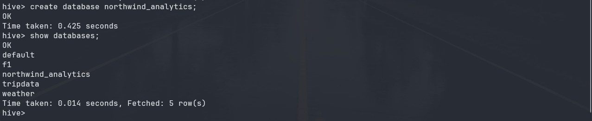
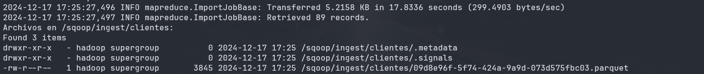
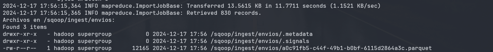
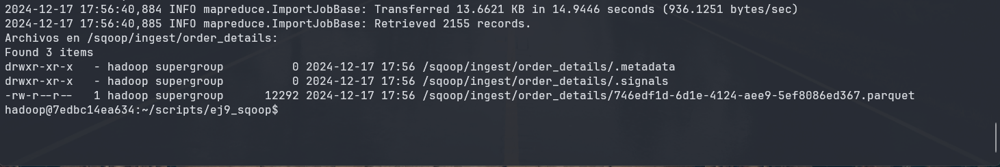
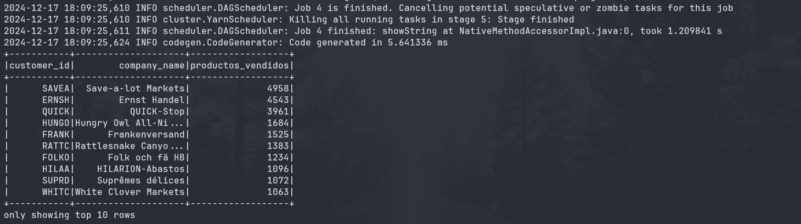
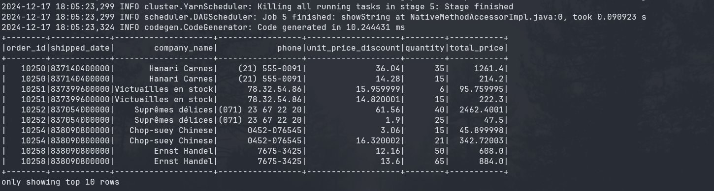
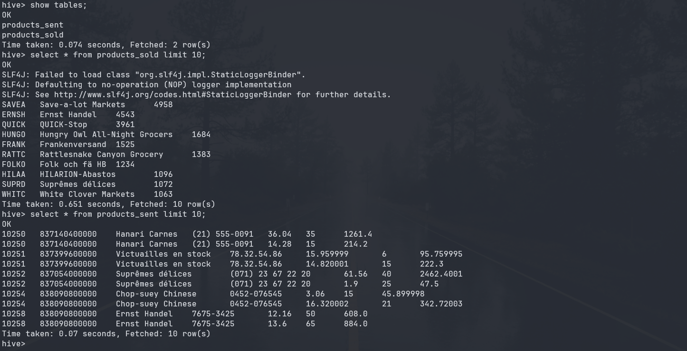

# Ejercicio Clase 9 - Sqoop y Airflow

## Objetivo

El objetivo principal de este ejercicio es integrar y analizar datos del sistema de gestión de bases de datos relacionales Northwind en un ecosistema Hadoop utilizando herramientas como Sqoop, Hive y Airflow.

A lo largo del ejercicio se busca:

- Extracción de datos: Usar Sqoop para importar tablas desde una base de datos relacional hacia Hive y HDFS.
- Transformación y modelado: Diseñar y crear tablas optimizadas en Hive para análisis de datos.
- Automatización: Orquestar el flujo de trabajo mediante DAGs en Airflow, asegurando la ejecución automática de procesos como la extracción y transformación de datos.
- Análisis: Realizar consultas en Hive para obtener información analítica de los datos importados, respondiendo a preguntas comerciales clave.
- Consolidación del aprendizaje: Poner en práctica el conocimiento de tecnologías como Sqoop, Hive y Airflow en un entorno distribuido de datos.

El ejercicio simula un caso práctico real en el que se deben integrar datos de una base de datos de producción y analizarlos de manera eficiente en un entorno de Big Data.

## Enunciado y paso a paso

El ejercicio se divide en las siguientes etapas:

1. Importación de datos con Sqoop: Importar tablas de la base de datos Northwind a HDFS y Hive.
2. Creación de tablas en Hive: Diseñar y crear tabla optimizadas en Hive para análisis de datos.
3. Automatización con Airflow: Crear un flujo de trabajo en Airflow para orquestar la importación y transformación de datos.
4. Análisis de datos: Realizar consultas en Hive para obtener información analítica de los datos importados.

### Enunciados de los ejercicios y resolución

1. Crear una base de datos en Hive llamada northwind_analytics

    ```sql
    CREATE DATABASE northwind_analytics;
    ```

    

2. Crear un script para importar un archivo .parquet de la base northwind que contenga la
lista de clientes junto a la cantidad de productos vendidos ordenados de mayor a menor
(campos customer_id, company_name, productos_vendidos). Luego ingestar el archivo
a HDFS (carpeta /sqoop/ingest/clientes). Pasar la password en un archivo

    import_clientes_sqoop.sh

    ```bash
    #!/bin/bash

    export PATH={{ var.value.PATH }}

    # Variables de configuración
    DB_HOST="172.17.0.3"
    DB_PORT="5432"
    DB_NAME="northwind"
    DB_USER="postgres"
    PASSWORD_FILE="/home/hadoop/postgres.pass"
    TARGET_DIR="/sqoop/ingest/clientes"
    TABLE_NAME="clientes_vendidos"
    QUERY="SELECT * FROM (
                SELECT c.customer_id, c.company_name, SUM(od.quantity) AS productos_vendidos
                FROM customers c
                JOIN orders o ON c.customer_id = o.customer_id
                JOIN order_details od ON o.order_id = od.order_id
                GROUP BY c.customer_id, c.company_name
                ORDER BY productos_vendidos DESC
            ) AS tmp WHERE 1=1"


    # Crear directorio en HDFS si no existe
    hdfs dfs -mkdir -p $TARGET_DIR

    sqoop import \
        --connect "jdbc:postgresql://${DB_HOST}:${DB_PORT}/${DB_NAME}" \
        --username $DB_USER \
        --password-file file://$PASSWORD_FILE \
        --query "$QUERY AND \$CONDITIONS" \
        --split-by customer_id \
        --target-dir $TARGET_DIR \
        --as-parquetfile \
        --m 1 \
        --delete-target-dir


    # Verificar la ingesta en HDFS
    echo "Archivos en $TARGET_DIR:"
    hdfs dfs -ls $TARGET_DIR
    ```

    

3. Crear un script para importar un archivo .parquet de la base northwind que contenga la
lista de órdenes junto a qué empresa realizó cada pedido (campos order_id,
shipped_date, company_name, phone). Luego ingestar el archivo a HDFS (carpeta
/sqoop/ingest/envíos). Pasar la password en un archivo

    import_envios_sqoop.sh

    ```bash
    #!/bin/bash

    export PATH={{ var.value.PATH }}

    # Variables de configuración
    DB_HOST="172.17.0.3"
    DB_PORT="5432"
    DB_NAME="northwind"
    DB_USER="postgres"
    PASSWORD_FILE="/home/hadoop/postgres.pass"
    TARGET_DIR="/sqoop/ingest/envios"
    TABLE_NAME="ordenes_envios"
    QUERY="SELECT * FROM (
                SELECT o.order_id, o.shipped_date, c.company_name, c.phone
                FROM orders o
                JOIN customers c ON o.customer_id = c.customer_id
            ) AS tmp WHERE 1=1"

    # Crear directorio en HDFS si no existe

    hdfs dfs -mkdir -p $TARGET_DIR

    # Comando de Sqoop para la importación

    sqoop import \
        --connect "jdbc:postgresql://${DB_HOST}:${DB_PORT}/${DB_NAME}" \
        --username $DB_USER \
        --password-file file://$PASSWORD_FILE \
        --query "$QUERY AND \$CONDITIONS" \
        --split-by order_id \
        --target-dir $TARGET_DIR \
        --as-parquetfile \
        --m 1 \
        --delete-target-dir 

    # Verificar la ingesta en HDFS

    echo "Archivos en $TARGET_DIR:"
    hdfs dfs -ls $TARGET_DIR
    ```

    

4. Crear un script para importar un archivo .parquet de la base northwind que contenga la
lista de detalles de órdenes (campos order_id, unit_price, quantity, discount). Luego
ingestar el archivo a HDFS (carpeta /sqoop/ingest/order_details). Pasar la password en
un archivo

    import_order_details.sh

    ```bash
    #!/bin/bash
    
    export PATH={{ var.value.PATH }}

    # Configuración de variables

    DB_HOST="172.17.0.3" # Dirección del servidor PostgreSQL
    DB_PORT="5432"       # Puerto de PostgreSQL
    DB_NAME="northwind"  # Nombre de la base de datos
    DB_USER="postgres"   # Usuario de la base de datos
    PASSWORD_FILE="/home/hadoop/postgres.pass" # Archivo con la contraseña
    TARGET_DIR="/sqoop/ingest/order_details"  # Carpeta de destino en HDFS
    TABLE_NAME="order_details"                # Nombre de la tabla en PostgreSQL

    # Query para obtener los datos de la tabla order_details

    QUERY="SELECT * FROM (
                SELECT od.order_id, od.unit_price, od.quantity, od.discount
                FROM order_details od
            ) AS tmp WHERE 1=1"

    # Crear el directorio de destino en HDFS si no existe

    hdfs dfs -mkdir -p $TARGET_DIR

    # Comando de Sqoop para importar los datos

    sqoop import \
        --connect "jdbc:postgresql://${DB_HOST}:${DB_PORT}/${DB_NAME}" \
        --username $DB_USER \
        --password-file file://$PASSWORD_FILE \
        --query "$QUERY AND \$CONDITIONS" \
        --split-by order_id \
        --target-dir $TARGET_DIR \
        --as-parquetfile \
        --m 1 \
        --delete-target-dir

    # Verificar la ingesta en HDFS

    echo "Archivos en $TARGET_DIR:"
    hdfs dfs -ls $TARGET_DIR
    ```

    

5. Generar un archivo .py que permita mediante Spark insertar en hive en la db
northwind_analytics en la tabla products_sold, los datos del punto 2, pero solamente
aquellas compañías en las que la cantidad de productos vendidos fue mayor al
promedio.

    ```python
    from pyspark.sql import SparkSession
    from pyspark.sql.functions import col, avg

    # Crear la sesión de Spark con soporte para Hive

    spark = SparkSession.builder \
        .appName("InsertProductsSold") \
        .enableHiveSupport() \
        .getOrCreate()


    # Ruta del directorio de HDFS donde está el archivo Parquet importado (punto 2)

    input_path = "/sqoop/ingest/clientes"

    # Nombre de la base de datos y tabla de destino en Hive

    hive_db = "northwind_analytics"
    hive_table = "products_sold"

    # Leer los datos desde HDFS en formato Parquet

    clientes_df = spark.read.parquet(input_path)

    # Calcular el promedio de productos vendidos

    promedio_productos = clientes_df.agg(avg("productos_vendidos").alias("promedio")).collect()[0]["promedio"]

    # Filtrar las compañías con productos vendidos mayores al promedio

    clientes_filtrados_df = clientes_df.filter(col("productos_vendidos") > promedio_productos)

    # Insertar los datos en Hive

    clientes_filtrados_df.write.mode("overwrite").insertInto(f"{hive_db}.{hive_table}")

    # Mostrar en pantalla los datos filtrados (opcional, para verificar)

    clientes_filtrados_df.show(10)

    # Finalizar la sesión de Spark

    spark.stop()

    ```

    

6. Generar un archivo .py que permita mediante Spark insertar en hive en la tabla
products_sent, los datos del punto 3 y 4, de manera tal que se vean las columnas
order_id, shipped_date, company_name, phone, unit_price_discount (unit_price with
discount), quantity, total_price (unit_price_discount * quantity). Solo de aquellos pedidos
que hayan tenido descuento.

    ```python
    from pyspark.sql import SparkSession
    from pyspark.sql.functions import col, expr

    # Crear la sesión de Spark con soporte para Hive

    spark = SparkSession.builder \
        .appName("InsertProductsSent") \
        .enableHiveSupport() \
        .getOrCreate()


    # Ruta de los archivos Parquet en HDFS (puntos 3 y 4)

    orders_path = "/sqoop/ingest/envios"  # Punto 3
    order_details_path = "/sqoop/ingest/order_details"  # Punto 4

    # Nombre de la base de datos y tabla de destino en Hive

    hive_db = "northwind_analytics"
    hive_table = "products_sent"

    # Leer los datos desde HDFS en formato Parquet

    orders_df = spark.read.parquet(orders_path)
    order_details_df = spark.read.parquet(order_details_path)

    # Filtrar los detalles de órdenes con descuento

    order_details_filtered_df = order_details_df.filter(col("discount") > 0)

    # Calcular unit_price_discount y total_price

    order_details_enhanced_df = order_details_filtered_df.withColumn(
        "unit_price_discount", col("unit_price") *(1 - col("discount"))
    ).withColumn(
        "total_price", col("unit_price_discount")* col("quantity")
    )

    # Unir orders_df con order_details_enhanced_df por order_id

    products_sent_df = order_details_enhanced_df.join(
        orders_df,
        on="order_id",
        how="inner"
    ).select(
        "order_id",
        "shipped_date",
        "company_name",
        "phone",
        "unit_price_discount",
        "quantity",
        "total_price"
    )

    # Insertar los datos en Hive

    products_sent_df.write.mode("overwrite").insertInto(f"{hive_db}.{hive_table}")

    # Mostrar en pantalla los datos procesados (opcional, para verificar)

    products_sent_df.show(10)

    # Finalizar la sesión de Spark

    spark.stop()
    ```

    

    Base de datos northwind_analytics con las tablas products_sold y products_sent en Hive

    

7. Realizar un proceso automático en Airflow que orqueste los pipelines creados en los
puntos anteriores. Crear un grupo para la etapa de ingest y otro para la etapa de
process. Correrlo y mostrar una captura de pantalla (del DAG y del resultado en la base
de datos)

    ```python
    from airflow import DAG
    from airflow.operators.bash import BashOperator
    from airflow.utils.dates import days_ago
    from airflow.utils.task_group import TaskGroup
    from airflow.operators.dummy import DummyOperator

    # Argumentos por defecto

    default_args = {
        'owner': 'Lucas Leonetti',
        'depends_on_past': False,
        'email_on_failure': False,
        'email_on_retry': False,
        'retries': 1,
    }

    # Definir el DAG

    with DAG(
        'northwind_etl_pipeline',
        default_args=default_args,
        description='Orquestación de ingestión y procesamiento con Sqoop y Spark',
        schedule_interval=None,
        start_date=days_ago(1),
        tags=['northwind', 'sqoop', 'spark', 'hive'],
    ) as dag:

        # Inicio del proceso
        start_process = DummyOperator(
            task_id='start_process',
            dag=dag
        )

        # Etapa de ingestión
        with TaskGroup("ingest_stage") as ingest_stage:
            ingest_clientes = BashOperator(
                task_id='ingest_clientes',
                bash_command='/usr/bin/sh /home/hadoop/scripts/ej9_sqoop/import_clientes_sqoop.sh '
            )

            ingest_envios = BashOperator(
                task_id='ingest_envios',
                bash_command='/usr/bin/sh /home/hadoop/scripts/ej9_sqoop/import_envios_sqoop.sh '
            )

            ingest_detalles = BashOperator(
                task_id='ingest_detalles',
                bash_command='/usr/bin/sh /home/hadoop/scripts/ej9_sqoop/import_order_details.sh '
            )

            # Dependencias en la etapa de ingestión
            [ingest_clientes, ingest_envios, ingest_detalles]

        # Etapa de procesamiento
        with TaskGroup("process_stage") as process_stage:
            process_products_sold = BashOperator(
                task_id='process_products_sold',
                bash_command='ssh hadoop@172.17.0.2 /home/hadoop/spark/bin/spark-submit --files /home/hadoop/hive/conf/hive-site.xml /home/hadoop/scripts/ej9_sqoop/process_products_sold.py '
            )

            process_products_sent = BashOperator(
                task_id='process_products_sent',
                bash_command='ssh hadoop@172.17.0.2 /home/hadoop/spark/bin/spark-submit --files /home/hadoop/hive/conf/hive-site.xml /home/hadoop/scripts/ej9_sqoop/process_products_sent.py '
            )

            # Dependencias en la etapa de procesamiento
            [process_products_sold, process_products_sent]

        # Final del proceso
        end_process = DummyOperator(
            task_id='end_process',
            dag=dag
        )

        # Dependencias entre etapas
        start_process >> ingest_stage >> process_stage >> end_process
    ```
