# Ejercicio Clase 9 - Ejercicio Streaming, Apache Kafka, Apache Spark, Hive y Airflow

## Objetivo

El objetivo de este ejercicio es realizar un flujo de datos completo, desde la generación de datos, pasando por la ingestión, procesamiento y almacenamiento de los mismos. Para ello, se utilizarán las siguientes tecnologías:

- Apache Kafka: Para la ingestión de datos.
- Apache Spark: Para el procesamiento de los datos.
- Apache Hive: Para el almacenamiento de los datos.
- Apache Airflow: Para la orquestación de los procesos.

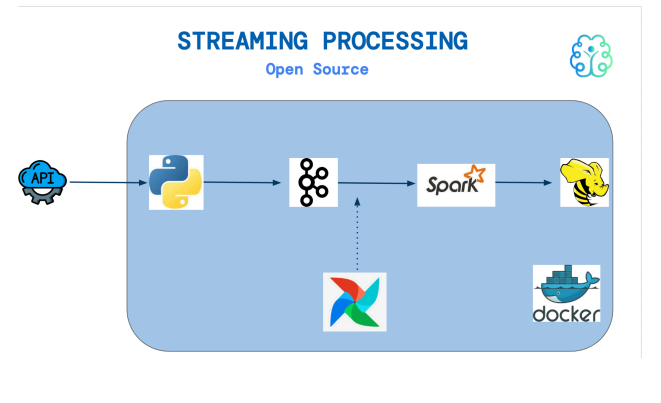

Los datos seran sinteticos generados por Rapidapi, y seran datos de Yahoo Weather en tiempo real.

## Paso a paso

Ejecutar el comando para inciar el contenedor de apache kafka (en mi caso, powershell) tener en cuenta que previamente se debe haber descargado la imagen de apache kafka:

```powershell
docker run -it -d `
-e "KAFKA_NODE_ID=1" `
-e "KAFKA_LISTENERS=PLAINTEXT://172.17.0.3:9092,CONTROLLER://172.17.0.3:9093" `
-e "KAFKA_ADVERTISED_LISTENERS=PLAINTEXT://172.17.0.3:9092" `
-e "KAFKA_LISTENER_SECURITY_PROTOCOL_MAP=CONTROLLER:PLAINTEXT,PLAINTEXT:PLAINTEXT" `
-e "KAFKA_ZOOKEEPER_CONNECT=null" `
-e "KAFKA_PROCESS_ROLES=broker,controller" `
-e "KAFKA_CONTROLLER_QUORUM_VOTERS=1@172.17.0.3:9093" `
-e "KAFKA_CONTROLLER_LISTENER_NAMES=CONTROLLER" `
-e "KAFKA_OFFSETS_TOPIC_REPLICATION_FACTOR=1" `
-e "KAFKA_TRANSACTION_STATE_LOG_REPLICATION_FACTOR=1" `
-e "KAFKA_TRANSACTION_STATE_LOG_MIN_ISR=1" `
--name edvai_kafka apache/kafka:3.7.1
```

ingreso al contenedor de apache kafka:

```powershell
docker exec -it edvai_kafka bash
```

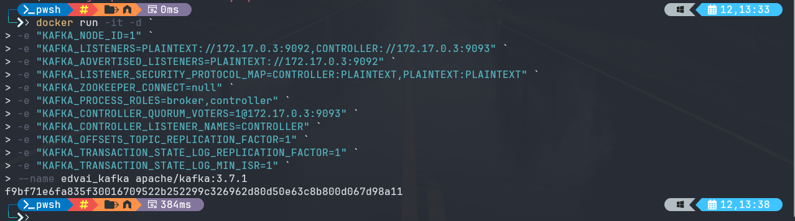

Creacion de un topico en apache kafka:

```bash
/opt/kafka/bin/kafka-topics.sh --create --bootstrap-server 172.17.0.3:9092 --topic weather
```

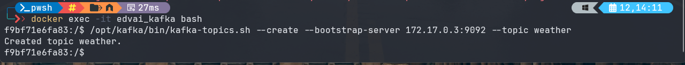

Lista de topicos en apache kafka:

```bash
/opt/kafka/bin/kafka-topics.sh --list --bootstrap-server 172.17.0.3:9092
```

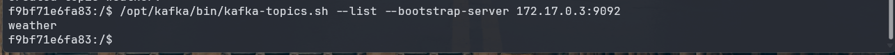

## WeatherAPI a KAFKA

Este primer DAG utiliza python para conectarse con la API de weather y enviar los datos a Kafka.

DAG_weather2kafka.py

```python
from airflow import DAG
from airflow.operators.bash import BashOperator
from airflow.utils.dates import days_ago
from datetime import timedelta

args = {
    'owner': 'Lucas Leonetti',
}

# Define el DAG
with DAG(
    dag_id="Weather2Kafka",
    default_args=args,
    start_date=days_ago(1),
    schedule_interval=timedelta(seconds=120),  # Se ejecuta cada 60 segundos
) as dag:
    # Tarea Bash que se activa según el intervalo programado
    bash_operator = BashOperator(
        task_id="stream_weather2kafka",
        bash_command='/usr/bin/python3 /home/hadoop/scripts/yahoo_weather2kafka.py ',
        dag=dag,
    )
```

Este es el archivo python que llama para que tome los datos de la API y los envié a Kafka

### yahoo_wheather2kafka.py

```python
# pip install kafka-python
import requests
import json
from kafka import KafkaProducer
import datetime

# Create variables
reduced_data = {}
kafka_topic = "weather"
kafka_boostrap_server = "172.17.0.3:9092"
url = "https://yahoo-weather5.p.rapidapi.com/weather"
querystring = {"location":"Neuquen Argentina","format":"json","u":"f"}
headers = {
    "x-rapidapi-key": "<API key>",
    "x-rapidapi-host": "yahoo-weather5.p.rapidapi.com"
}

# Get Neuquen weather
response = requests.get(url, headers=headers, params=querystring)
response_text = response.content.decode('utf-8')
data = json.loads(response_text)

# Get some values
country = data['location']['country']
city = data['location']['city']
date_time_u = data['current_observation']['pubDate']
dt = datetime.datetime.fromtimestamp(date_time_u)
date_time = dt.strftime('%Y-%m-%d %H:%M:%S')
wind_kph = data['current_observation']['wind']['speed']
temp_f = data['current_observation']['condition']['temperature']
temp_c = round((temp_f - 32) * 5 / 9, 1)
humidity = data['current_observation']['atmosphere']['humidity']
pressure_mb = data['current_observation']['atmosphere']['pressure']

# Put values in dictionary
reduced_data["country"] = country
reduced_data["city"] = city
reduced_data["datetime"] = date_time
reduced_data["wind_kph"] = wind_kph
reduced_data["temp_c"] = temp_c
reduced_data["humidity"] = humidity
reduced_data["pressure_mb"] = pressure_mb

# Convert the dictionary to a JSON string
json_string = json.dumps(reduced_data, indent=4)
# Print the JSON string
print(json_string)

# Send JSON values to Kafka
producer = KafkaProducer(bootstrap_servers=kafka_boostrap_server)
producer.send(kafka_topic, json_string.encode('utf-8'))
producer.close()
```

### Instalar en hadoop, kafka-python

> pip install kafka-python

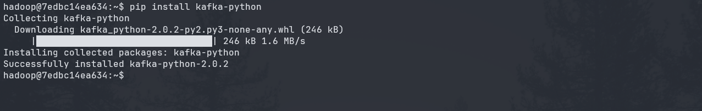

## Stream weather a Hive

Este DAG toma los datos de Kafka y los envía a Hive

### DAG_str_weather.py

```python
from datetime import timedelta
from airflow import DAG
from airflow.operators.bash import BashOperator
from airflow.operators.dummy import DummyOperator
from airflow.utils.dates import days_ago

args = {
    'owner': 'Lucas Leonetti',
}

with DAG(
    dag_id='streaming-transform-weather',
    default_args=args,
    schedule_interval='0 0 * * *',
    start_date=days_ago(1),
    dagrun_timeout=timedelta(minutes=60),
    tags=['kafka', 'streaming_transform'],
    ) as dag:

    inicia_proceso = DummyOperator(
        task_id='inicia_proceso',
    )

    streaming = BashOperator(
        task_id='streaming_process',
        bash_command='ssh hadoop@172.17.0.2 /home/hadoop/spark/bin/spark-submit --files /home/hadoop/hive/conf/hive-site.xml --packages org.apache.spark:spark-sql-kafka-0-10_2.12:3.2.0 /home/hadoop/scripts/weather_str_transform.py ',
        do_xcom_push=False,
)

inicia_proceso >> streaming

if __name__ == "__main__":
    dag.cli()

```

Este es el archivo python que hace la ingesta desde Kafka y luego hace el Load a Hive

### weather_str_transform.py

```python
from pyspark.context import SparkContext
from pyspark.sql.session import SparkSession
from pyspark.sql.types import StructType, StringType, IntegerType, StructField, FloatType
from pyspark.sql.functions import col, from_json

# Crear una sesión de Spark
spark = SparkSession.builder \
    .appName("Continuous Stream") \
    .enableHiveSupport() \
    .getOrCreate()

sc = spark.sparkContext
sc.setLogLevel("OFF")

# Leer el tópico de Kafka
df = spark.readStream \
    .format("kafka") \
    .option("kafka.bootstrap.servers", "172.17.0.3:9092") \
    .option("subscribe", "weather") \
    .option("startingOffsets", "earliest") \
    .load()

# Convertir valores binarios del DataFrame a strings
weatherStringDF = df.selectExpr("CAST(value AS STRING)")

# Definir el esquema
schema = StructType([
    StructField("country", StringType(), True),
    StructField("city", StringType(), True),
    StructField("datetime", StringType(), True),
    StructField("wind_kph", FloatType(), True),
    StructField("temp_c", FloatType(), True),
    StructField("humidity", FloatType(), True),
    StructField("pressure_mb", FloatType(), True)
])

# Transformar los valores del JSON y seleccionar la data
weatherDF = weatherStringDF.select(
    from_json(col("value"), schema).alias("data")
).select("data.*")

# Mostrar en pantalla la salida (opcional)
# weatherDF.writeStream.format("console").outputMode("append").start().awaitTermination()

# Escribir en Hive
query = weatherDF.writeStream \
    .foreachBatch(lambda batchDs, batchId: 
        batchDs.write \
            .mode("append") \
            .insertInto("weather.weatherneuquen")
    ).start()

# Esperar a que llegue más data
query.awaitTermination()

```

*NOTA Importante:* este segundo DAG puede que lo muestre como finalizado debido a
que no espera a que finalice. De todas maneras el proceso sigue corriendo en spark y lo
podrán monitorear desde Yarn.

Para finalizar hay que matar el proceso con el siguiente comando:
>yarn application -kill application_1724621544631_0007

## Hive

Primero debemos crear una base de datos llamada weather:

```sql
CREATE database weather;
```

Luego debemos crear una tabla para cargar la información que proviene de spark

```sql
create external table weather.weatherneuquen (
country string,
city string,
datetime string,
wind_kph float,
temp_c float,
humidity float,
pressure_mb float
)
row format delimited
fields terminated by ','
location '/tables/external/weather';
```

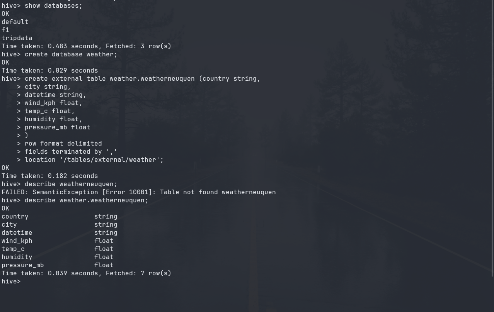

## Airflow

Desde Airflow primero arrancamos el DAG que toma la información de la API y la envía a
Kafka:

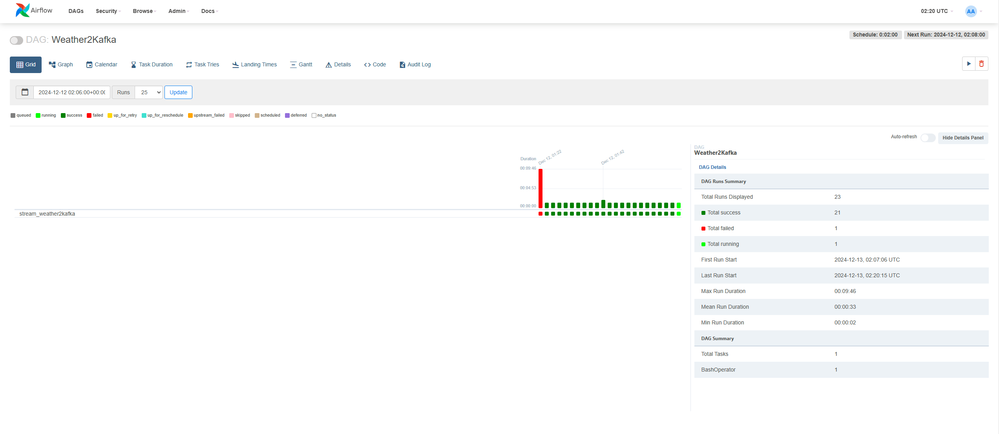

Luego arrancamos el DAG que toma la información de Kafka y la envía a Hive:

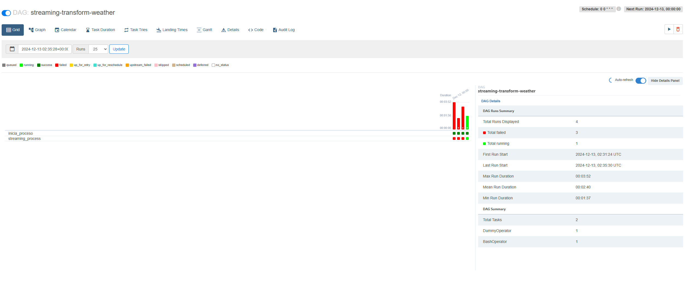

## Aplication Yarn

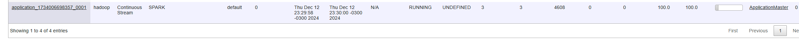

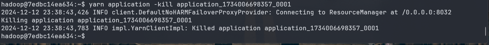

## Spark

En caso que quieras utilizar la consola de spark para probar transformaciones podrás ingresar
de la siguiente manera.

Iniciar pyspark

>pyspark --packages org.apache.spark:spark-sql-kafka-0-10_2.12:3.2.0

## Consulta Hive

Para ver los datos en Hive, ingresamoa a Hive y ejecutamos la siguiente consulta:

```sql
select * from weather.weatherneuquen;
```

Esto nos mostrará los datos que se han cargado en la tabla durante el proceso.

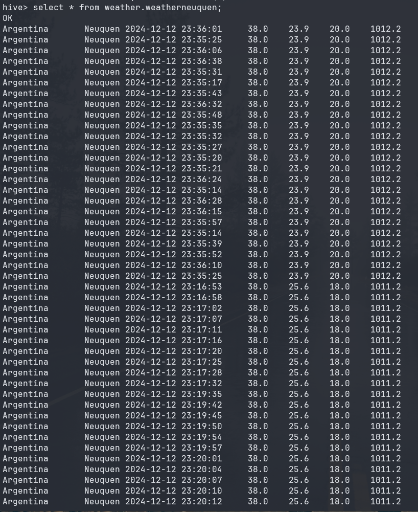
