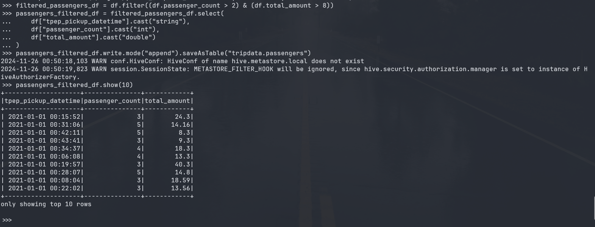

# Ejercicios de PySpark y Carga en Hive

## Informacion General

En este repositorio se encuentran los ejercicios de PySpark y carga en Hive. Todo sobre el ecosistema de Apache Hadoop.

1. En Hive, crear las siguientes tablas (internas) en la base de datos tripdata en hive:
    * payments(VendorID, tpep_pickup_datetetime, payment_type, total_amount)
    * passengers(tpep_pickup_datetetime, passenger_count, total_amount)
    * tolls (tpep_pickup_datetetime, passenger_count, tolls_amount, total_amount)
    * congestion (tpep_pickup_datetetime, passenger_count, congestion_surcharge,
    total_amount)
    * distance (tpep_pickup_datetetime, passenger_count, trip_distance,
    total_amount)

    

2. En Hive, hacer un ‘describe’ de las tablas passengers y distance.
    
3. Hacer ingest del file: Yellow_tripodata_2021-01.csv*
    <https://dataengineerpublic.blob.core.windows.net/data-engineer/yellow_tripdata_2021-01.csv>
    
4. Insertar en la tabla payments (VendorID, tpep_pickup_datetetime, payment_type,
    total_amount) Solamente los pagos con tarjeta de crédito
    
    
    * Insertar en la tabla passengers (tpep_pickup_datetetime, passenger_count,
    total_amount) los registros cuya cantidad de pasajeros sea mayor a 2 y el total del viaje
    cueste más de 8 dólares.
    
    
    * Insertar en la tabla tolls (tpep_pickup_datetetime, passenger_count, tolls_amount,
    total_amount) los registros que tengan pago de peajes mayores a 0.1 y cantidad de
    pasajeros mayores a 1.
    
    
    * Insertar en la tabla congestion (tpep_pickup_datetetime, passenger_count,
    congestion_surcharge, total_amount) los registros que hayan tenido congestión en los
    viajes en la fecha 2021-01-18
    
    
    * Insertar en la tabla distance (tpep_pickup_datetetime, passenger_count, trip_distance,
    total_amount) los registros de la fecha 2020-12-31 que hayan tenido solamente un
    pasajero (passenger_count = 1) y hayan recorrido más de 15 millas (trip_distance).
    
    
