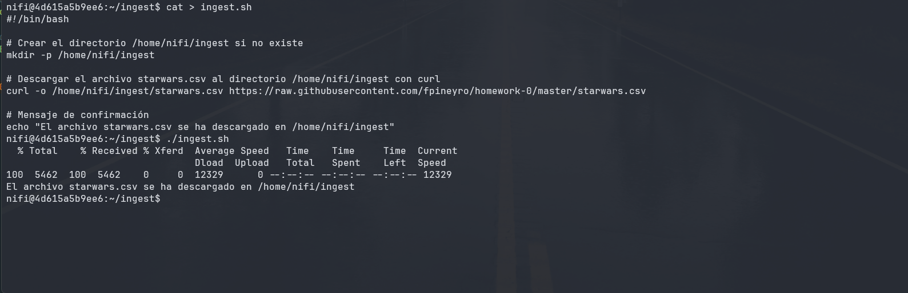
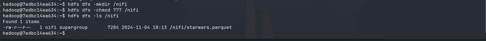

# Ingesta de datos con Apache NiFi

---

## Objetivo

El objetivo de este ejercicio es realizar la ingestión de datos de un archivo CSV a HDFS utilizando Apache NiFi. Realizando ciertas transformaciones en los datos antes de ser almacenados en HDFS. Como cambiar la extensión del archivo, cambiar el nombre del archivo y cambiar el formato de los datos.

> <https://localhost:8443/nifi>

## Ejercicios

1. En el shell de Nifi, crear un script .sh que descargue el archivo starwars.csv al directorio
/home/nifi/ingest (crearlo si es necesario). Ejecutarlo con `./home/nifi/ingest/ingest.sh`

2. Usando procesos Nifi:
    - tomar el archivo `starwars.csv` desde el directorio `/home/nifi/ingest`.
    - Mover el archivo `starwars.csv` desde el directorio anterior, a `/home/nifi/bucket`(crear el directorio si es necesario)
    - Tomar nuevamente el archivo, ahora desde `/home/nifi/bucket`
    - Ingestarlo en HDFS/nifi (si es necesario, crear el directorio con `hdfs dfs -mkdir/nifi`)

## Atencion

- Para que Nifi pueda ingestar el archivo a HDFS, debe asignársele el permiso desde la
consola de Hadoop con el comando `hdfs dfs -chmod 777 /nifi`.

- Desde la consola de nifi, es necesario agregar dos archivos de configuración llamados
core-site.xml y hdfs-site.xml al directorio /home/nifi/hadoop (crearlo si es necesario). Al
final de este archivo está detallado cuál debe ser el contenido de ambos archivos

- Luego desde la interfaz gráfica de Nifi, al crear el proceso de ingesta de HDFS se debe
definir en ‘Properties/Hadoop Configuration Resources’ la ruta a los archivos de
configuración: `/home/nifi/hadoop/core-site.xml`, `/home/nifi/hadoop/hdfs-site.xml`

## Soluciónes y capturas de pantalla

1. Crear un script .sh que descargue el archivo starwars.csv al directorio /home/nifi/ingest

    ```bash
    #!/bin/bash

    # Crear el directorio /home/nifi/ingest si no existe
    mkdir -p /home/nifi/ingest

    # Descargar el archivo starwars.csv al directorio /home/nifi/ingest con curl
    curl -o /home/nifi/ingest/starwars.csv https://raw.githubusercontent.com/fpineyro/homework-0/master/starwars.csv

    # Mensaje de confirmación
    echo "El archivo starwars.csv se ha descargado en /home/nifi/ingest"
    ```

    

2. Procesos Nifi

    - para que siga se pueda ir visualizando los pasos y los flujos, se iran adjuntando capturas de pantalla en cada paso.

    

    Aqui se visualiza el proceso de NiFi, donde se toma el archivo `starwars.csv` desde el directorio `/home/nifi/ingest`. Luego se procede a convertir el archivo a un archivo formato `.parquet` y se cambia la extension del archivo a `starwars.parquet`. Posteriormente se mueve el archivo `starwars.parquet` al directorio `/home/nifi/bucket`. Finalmente se borra el archivo `starwars.parquet` del directorio `/home/nifi/ingest`.

    

    Aqui se visualiza el proceso de NiFi, donde se toma el archivo `starwars.parquet` desde el directorio `/home/nifi/bucket`. Luego se procede a mover el archivo `starwars.parquet` al directorio `/home/nifi/bucket`. Posteriormente se ingesta el archivo `starwars.parquet` en HDFS/nifi.

    

    Aqui se visualiza el proceso de NiFi, donde se ingesta el archivo `starwars.parquet` en HDFS/nifi.
