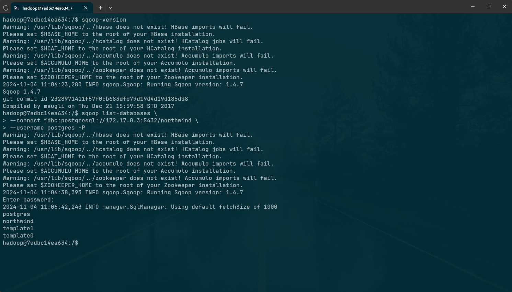
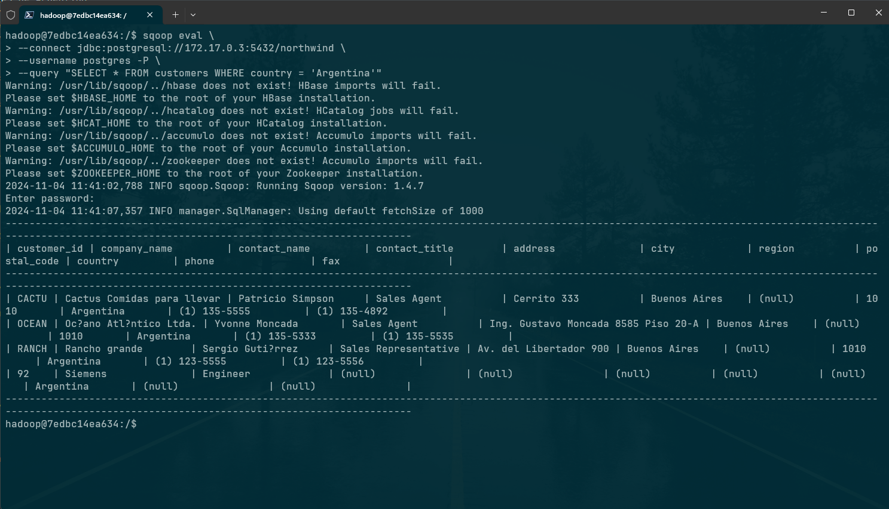
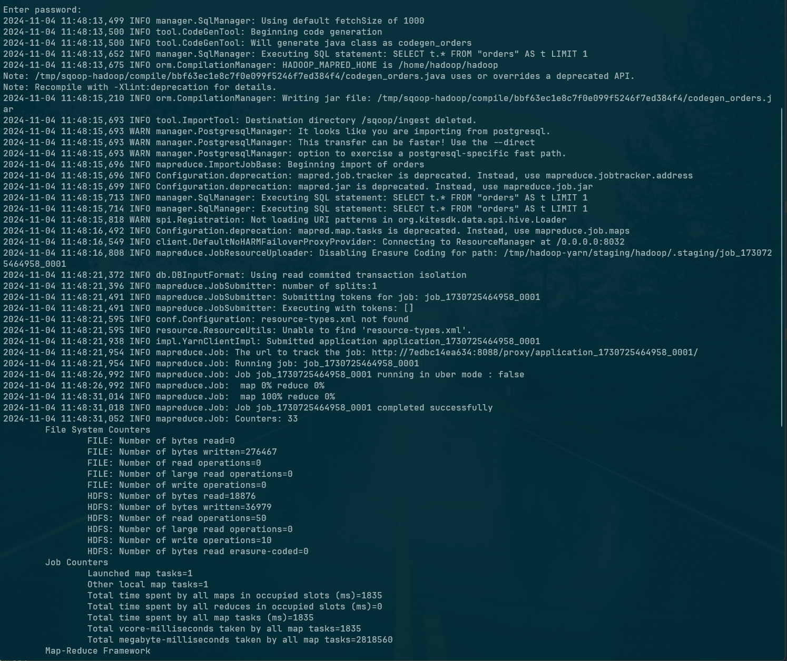
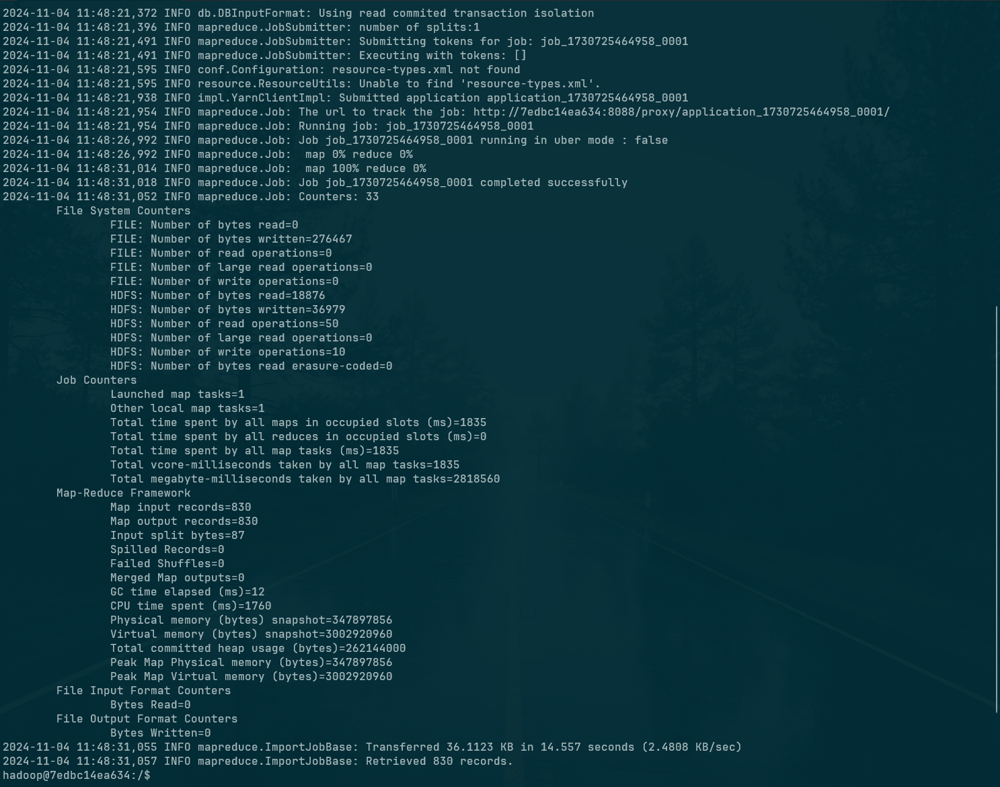
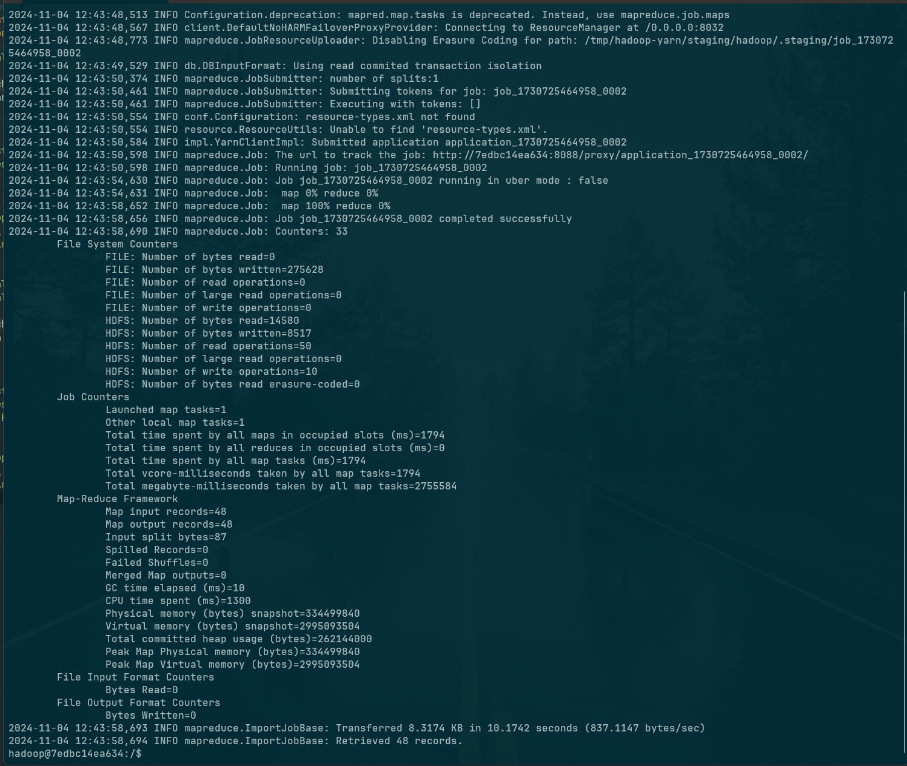

# Sqoop Ingest PostgreSQL

## Objetivo

El objetivo de este script es realizar la ingestión de datos de una base de datos PostgreSQL a HDFS utilizando Sqoop.

Ejercicios:

1) Mostrar las tablas de la base de datos northwind
2) Mostrar los clientes de Argentina
3) Importar un archivo `.parquet` que contenga toda la tabla orders. Luego ingestar el
archivo a HDFS (carpeta /sqoop/ingest)
4) Importar un archivo `.parquet` que contenga solo los productos con mas 20 unidades en
stock, de la tabla Products . Luego ingestar el archivo a HDFS (carpeta ingest)

## Resoluciones con capturas

1. Mostrar las tablas de la base de datos northwind

    ```sh
    sqoop list-databases \
    --connect jdbc:postgresql://172.17.0.3:5432/northwind \
    --username postgres -P
    ```

    

2. Mostrar los clientes de Argentina

    ```sh
    sqoop eval \
    --connect jdbc:postgresql://172.17.0.3:5432/northwind \
    --username postgres -P \
    --query "SELECT * FROM customers WHERE country = 'Argentina'"
    ```

    

3. Importar un archivo `.parquet` que contenga toda la tabla orders. Luego ingestar el
archivo a HDFS (carpeta /sqoop/ingest)

    ```sh
    sqoop import \
    --connect jdbc:postgresql://172.17.0.3:5432/northwind \
    --username postgres \
    --table orders \
    --m 1 \
    --P \
    --target-dir /sqoop/ingest \
    --as-parquetfile \
    --delete-target-dir
    ```

    
    

4. Importar un archivo `.parquet` que contenga solo los productos con mas 20 unidades en
stock, de la tabla Products . Luego ingestar el archivo a HDFS (carpeta ingest)

    ```sh
    sqoop import \
    --connect jdbc:postgresql://172.17.0.3:5432/northwind \
    --username postgres \
    --query "SELECT * FROM products WHERE units_in_stock > 20 AND \$CONDITIONS" \
    --m 1 \
    --P \
    --target-dir /sqoop/ingest \
    --as-parquetfile \
    --delete-target-dir
    ```

    
